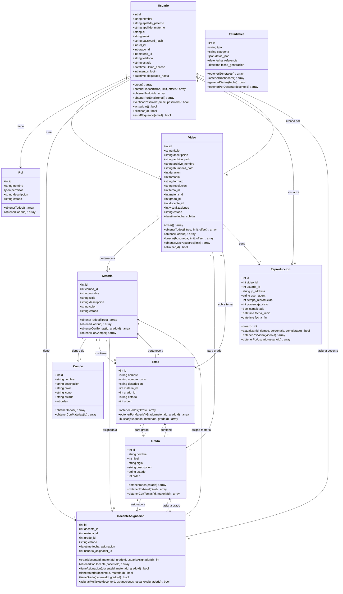

# Diagrama de Clases - Modelo de Datos

## Descripción

Este diagrama muestra las **10 clases principales** del modelo de datos del backend PHP:

- **Usuario**: Administradores y docentes del sistema
- **Video**: Catálogo de videos educativos
- **Materia**: Asignaturas del currículo boliviano (14 materias)
- **Grado**: Niveles de secundaria (1-6)
- **Campo**: Campos de saberes (4 campos)
- **Tema**: Temas específicos por materia y grado
- **Reproduccion**: Registro de visualizaciones
- **DocenteAsignacion**: Asignaciones docente-materia-grado
- **Estadistica**: Métricas del sistema
- **Rol**: Roles y permisos (Administrador, Docente)

### Relaciones Clave

- Un **Usuario** puede crear muchos **Videos**
- Un **Video** pertenece a una **Materia** y un **Grado**
- Las **Materias** pertenecen a un **Campo** de saberes
- **DocenteAsignacion** es la tabla central que relaciona docentes con combinaciones materia-grado
