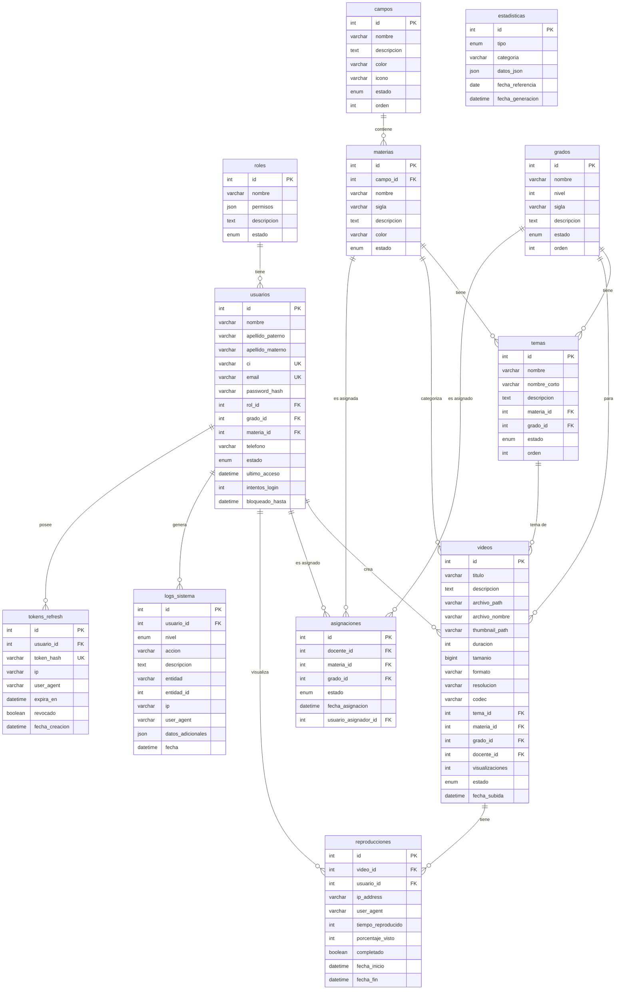

# Diagrama Entidad-Relación - Base de Datos



## Descripción de Tablas

### Tablas Principales (11)

| Tabla | Descripción | Registros Aprox. |
|-------|-------------|------------------|
| `roles` | Roles del sistema (Administrador, Docente) | 2 |
| `usuarios` | Administradores y docentes | Variable |
| `campos` | Campos de saberes del currículo boliviano | 4 |
| `materias` | Asignaturas por campo | 14 |
| `grados` | Niveles de secundaria | 6 |
| `temas` | Temas por materia y grado | ~600 |
| `asignaciones` | Relación docente-materia-grado | Variable |
| `videos` | Catálogo de videos educativos | Variable |
| `reproducciones` | Registro de visualizaciones | Variable |
| `estadisticas` | Métricas agregadas | Variable |
| `logs_sistema` | Auditoría de acciones | Variable |
| `tokens_refresh` | Tokens JWT de refresco | Variable |

### Elementos de Base de Datos

#### Triggers (4)
1. **after_usuario_insert** - Registra creación de usuario
2. **after_video_insert** - Registra subida de video
3. **before_video_delete** - Registra eliminación de video
4. **after_reproduccion_insert** - Incrementa visualizaciones

#### Vistas (5)
1. **vista_videos_completos** - Videos con información completa
2. **vista_stats_por_materia** - Estadísticas por materia
3. **vista_stats_por_grado** - Estadísticas por grado
4. **vista_videos_populares** - Top 10 más vistos
5. **vista_docentes_asignaciones** - Docentes con asignaciones

#### Procedimientos Almacenados (3)
1. **sp_estadisticas_generales()** - Contadores generales
2. **sp_limpiar_tokens_expirados()** - Limpieza de tokens
3. **sp_buscar_videos()** - Búsqueda parametrizada

#### Eventos Programados (2)
1. **evento_limpiar_tokens** - Diario, limpia tokens expirados
2. **evento_estadisticas_diarias** - Diario, genera estadísticas

### Tabla Central: `asignaciones`

Esta tabla es el **corazón del sistema de permisos** para docentes:

```sql
UNIQUE KEY (docente_id, materia_id, grado_id)
```

Relaciona docentes con combinaciones específicas de materia-grado, permitiendo control granular de qué videos puede subir cada docente.
