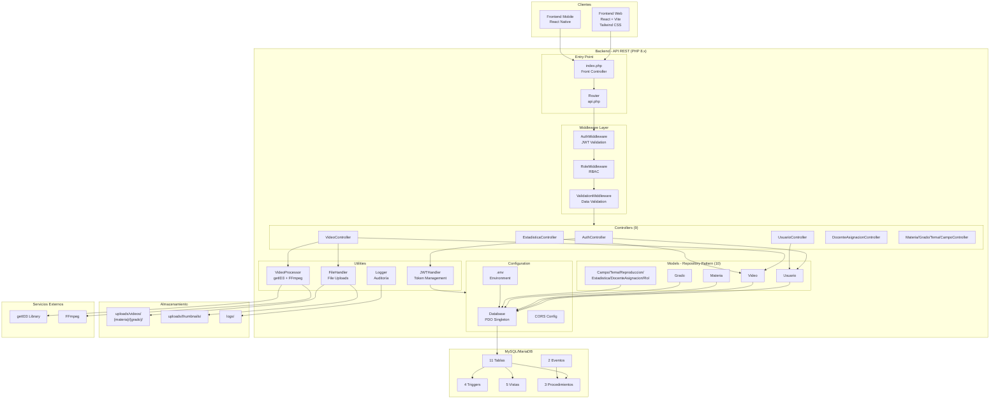
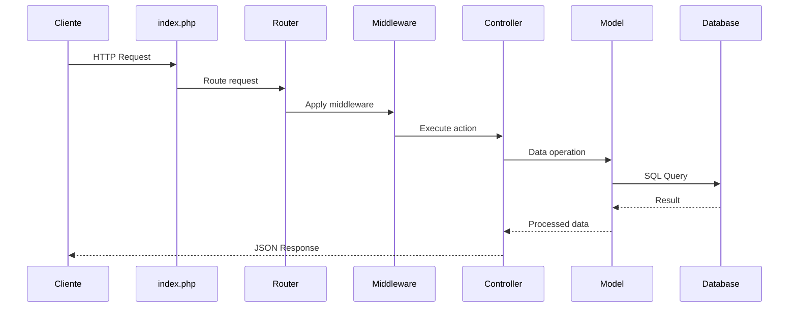

# Diagrama de Arquitectura - Componentes del Sistema



## Arquitectura del Sistema

### Patrón MVC Adaptado para API REST

```
Cliente → index.php → Router → Middleware → Controller → Model → Database
```

### Capas del Sistema

#### 1. Clientes
- **Frontend Web**: React + Vite + Tailwind CSS
- **Frontend Mobile**: React Native

#### 2. Entry Point
- **index.php**: Front Controller Pattern
  - Manejo global de errores
  - Timezone: America/La_Paz
  - CORS headers
  - Carga de configuración
- **Router (api.php)**: ~60 endpoints

#### 3. Middleware
- **AuthMiddleware**: Validación de JWT
- **RoleMiddleware**: Control de acceso basado en roles (RBAC)
- **ValidationMiddleware**: Validación y sanitización de datos

#### 4. Controllers (9)
| Controller | Responsabilidad |
|------------|----------------|
| AuthController | Login, Register, Refresh, Logout |
| VideoController | CRUD + Streaming + Búsqueda |
| UsuarioController | Gestión de usuarios |
| EstadisticaController | Dashboard y métricas |
| DocenteAsignacionController | Asignaciones |
| MateriaController | Gestión de materias |
| GradoController | Gestión de grados |
| TemaController | Gestión de temas |
| CampoController | Gestión de campos |

#### 5. Models (10) - Repository Pattern
Encapsulan acceso a datos con prepared statements (PDO)

#### 6. Utilities
- **JWTHandler**: Tokens access (1h) y refresh (7 días)
- **Logger**: Auditoría en BD y archivos
- **FileHandler**: Subida de videos y thumbnails
- **VideoProcessor**: Metadatos (getID3) + Thumbnails (FFmpeg)

#### 7. Database
- **Singleton Pattern** para conexión PDO única
- Triggers, vistas, procedimientos y eventos

### Patrones de Diseño

| Patrón | Implementación |
|--------|----------------|
| Front Controller | index.php |
| Chain of Responsibility | Middleware en cadena |
| Repository | Models encapsulan acceso a datos |
| Singleton | Database connection |
| Factory | JWTHandler genera diferentes tokens |

### Flujo de una Request


