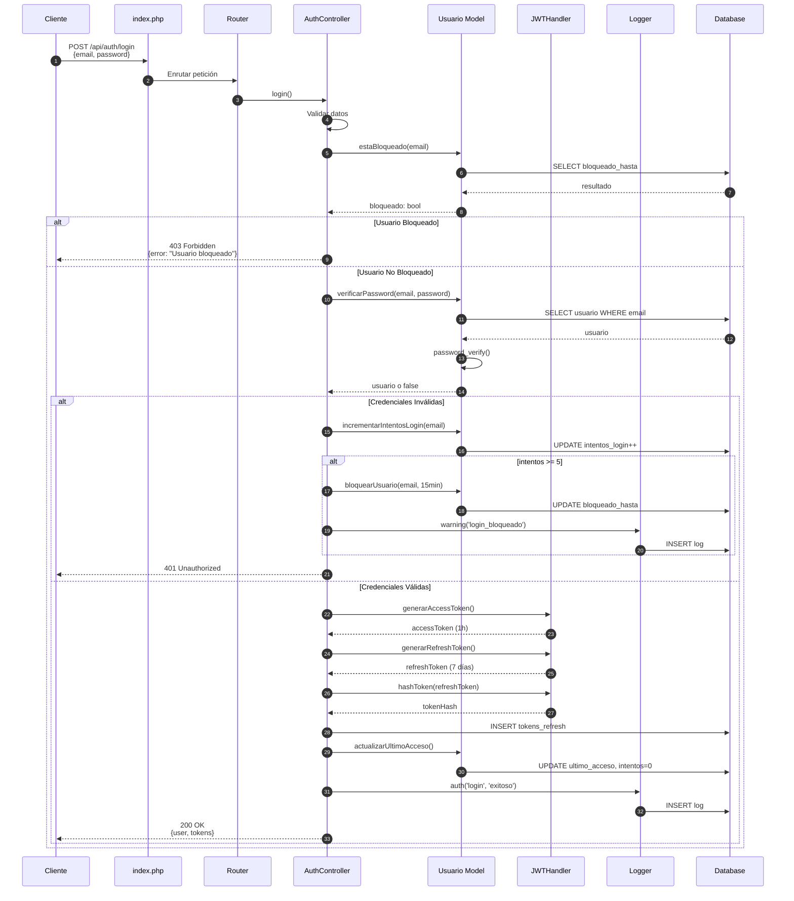
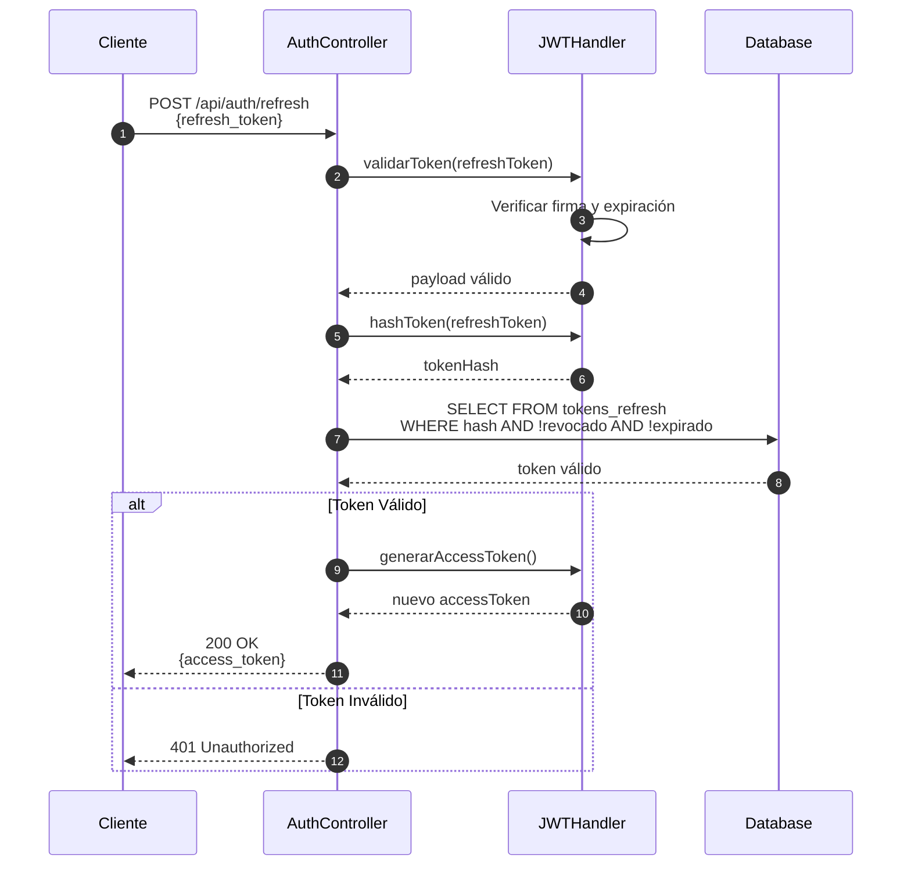
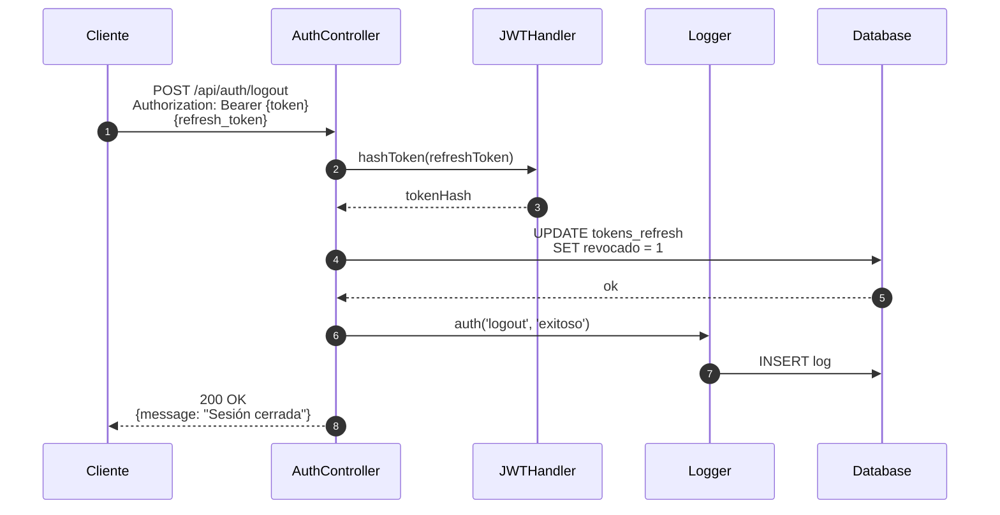

# Diagrama de Secuencia - Autenticación

## Flujo de Login



## Flujo de Refresh Token



## Flujo de Logout



## Aspectos de Seguridad

### Password Hashing
```php
// Creación
password_hash($password, PASSWORD_BCRYPT, ['cost' => 12])

// Verificación
password_verify($password, $hash)
```

### JWT (JSON Web Tokens)
- **Algoritmo**: HMAC-SHA256
- **Access Token**: 1 hora de validez
- **Refresh Token**: 7 días de validez
- **Almacenamiento**: Refresh token hasheado con SHA-256

### Control de Intentos
- **Máximo intentos**: 5
- **Tiempo de bloqueo**: 15 minutos
- **Reset automático**: Al login exitoso

### Estructura del Token

```json
{
  "header": {
    "typ": "JWT",
    "alg": "HS256"
  },
  "payload": {
    "iss": "videoteca-api",
    "aud": "videoteca-client",
    "iat": 1700000000,
    "exp": 1700003600,
    "type": "access",
    "user_id": 1,
    "email": "usuario@ejemplo.com",
    "rol": "Docente",
    "nombre": "Juan Pérez"
  }
}
```
