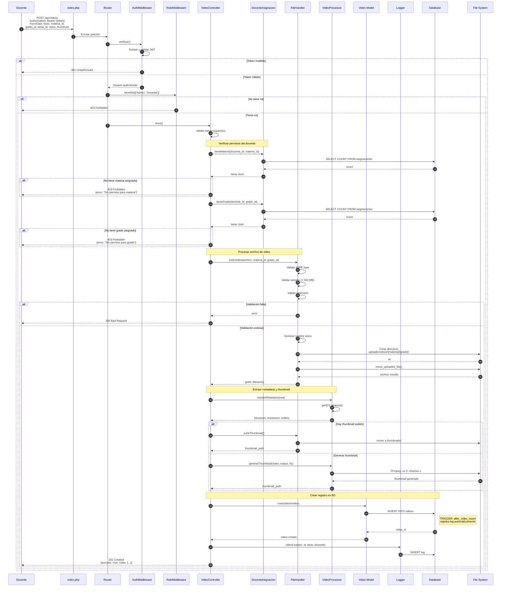
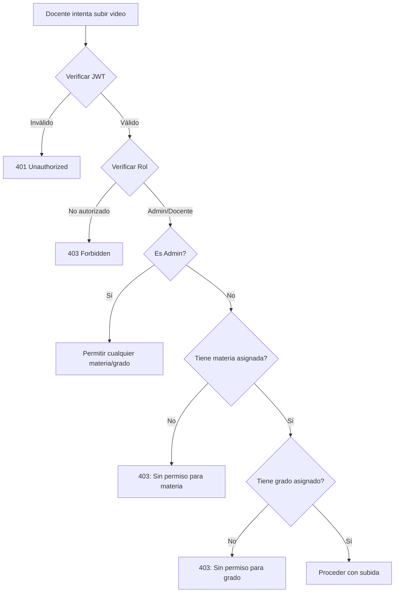
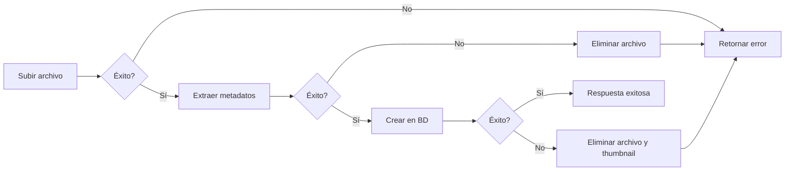

# Diagrama de Secuencia - Subida de Video

## Flujo Completo de Subida (Docente)



## Validación de Permisos



## Procesamiento de Archivos

### Validaciones

| Validación | Criterio |
|------------|----------|
| MIME Type | video/mp4, video/x-msvideo, video/quicktime, video/x-matroska |
| Tamaño máximo | 500 MB |
| Extensiones | .mp4, .avi, .mov, .mkv |

### Organización de Archivos

```
uploads/
├── videos/
│   ├── {materia_id}/
│   │   ├── {grado_id}/
│   │   │   ├── 1700000000_abc123_video.mp4
│   │   │   └── 1700000001_def456_otro.mp4
│   │   └── ...
│   └── ...
└── thumbnails/
    ├── 1700000000_abc123_video.jpg
    └── 1700000001_def456_otro.jpg
```

### Metadatos Extraídos (getID3)

```php
[
    'duracion' => 320,          // segundos
    'resolucion' => '1920x1080',
    'codec' => 'h264',
    'tamanio' => 45678900        // bytes
]
```

## Manejo de Errores



El sistema garantiza limpieza de archivos si ocurre algún error después de la subida pero antes de completar el proceso.
