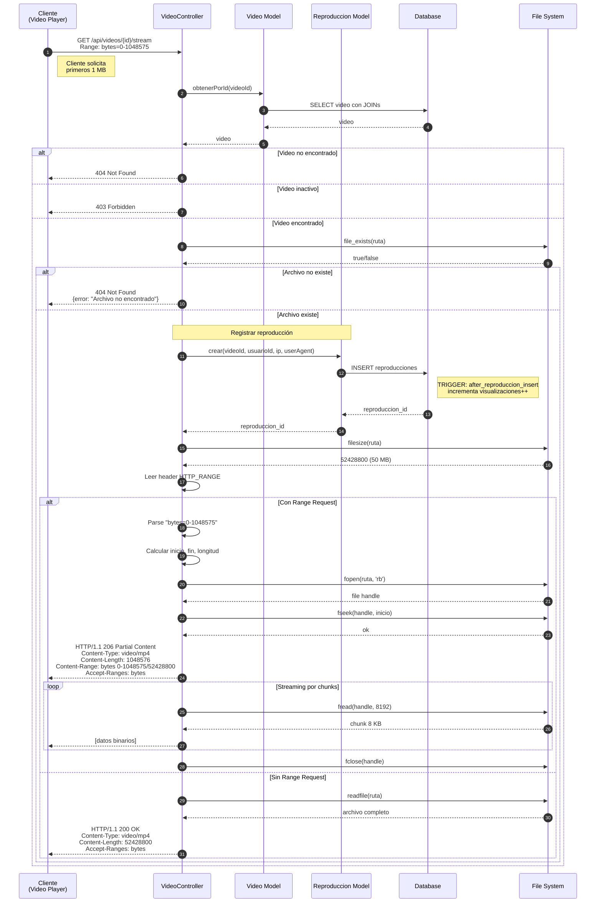
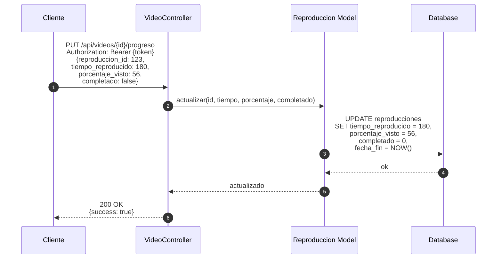
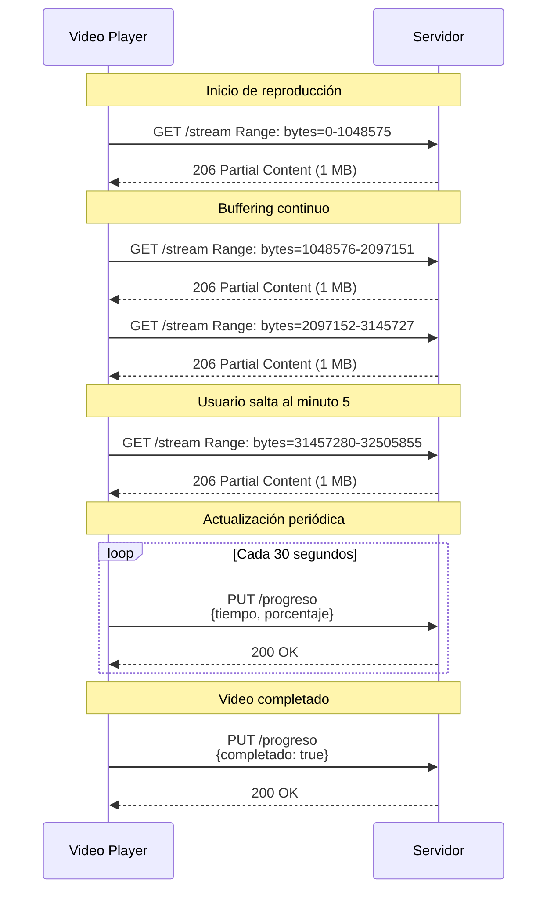

# Diagrama de Secuencia - Streaming de Video

## Streaming con Range Requests



## Actualización de Progreso



## Flujo del Video Player



## HTTP Headers

### Request Headers
```http
GET /api/videos/123/stream HTTP/1.1
Host: api.videoteca.com
Range: bytes=0-1048575
```

### Response Headers (206 Partial Content)
```http
HTTP/1.1 206 Partial Content
Content-Type: video/mp4
Content-Length: 1048576
Content-Range: bytes 0-1048575/52428800
Accept-Ranges: bytes
Content-Disposition: inline; filename="video.mp4"
```

### Response Headers (200 OK - Sin Range)
```http
HTTP/1.1 200 OK
Content-Type: video/mp4
Content-Length: 52428800
Accept-Ranges: bytes
Content-Disposition: inline; filename="video.mp4"
```

## Características del Streaming

| Característica | Valor |
|----------------|-------|
| Tamaño de chunk | 8 KB (8192 bytes) |
| Soporte Range Requests | Sí (HTTP 206) |
| Registro de visualización | Automático al iniciar |
| Actualización de progreso | Manual desde cliente |
| MIME Type Detection | Automático por extensión |

## Tabla de Reproducciones

```sql
CREATE TABLE reproducciones (
    id INT PRIMARY KEY,
    video_id INT NOT NULL,
    usuario_id INT,              -- NULL para anónimos
    ip_address VARCHAR(45),
    user_agent VARCHAR(500),
    tiempo_reproducido INT DEFAULT 0,
    porcentaje_visto INT DEFAULT 0,
    completado BOOLEAN DEFAULT 0,
    fecha_inicio DATETIME,
    fecha_fin DATETIME
);
```

El trigger `after_reproduccion_insert` incrementa automáticamente el contador `visualizaciones` en la tabla `videos`.
