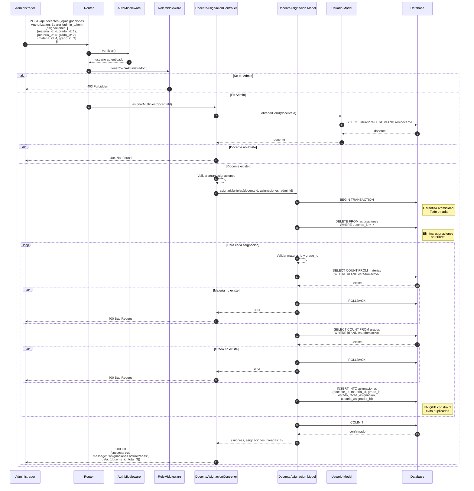
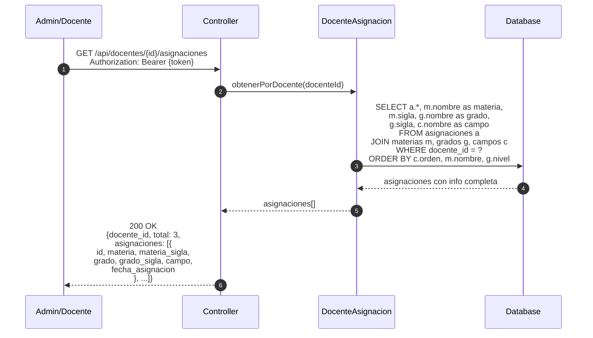
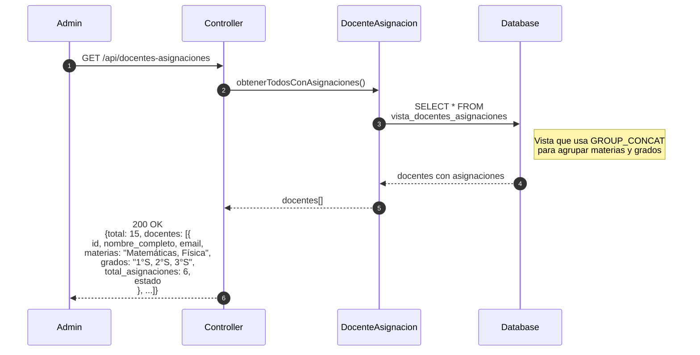
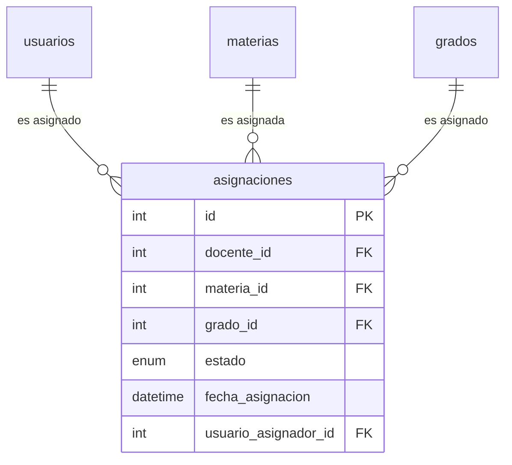
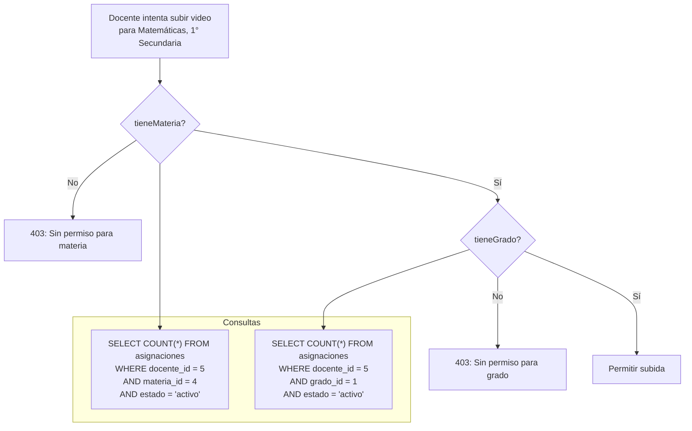

# Diagrama de Secuencia - Asignación de Docentes

## Asignación Múltiple



## Consulta de Asignaciones



## Vista Consolidada de Todos los Docentes



## Modelo de Datos de Asignaciones



## Constraint Único

```sql
UNIQUE KEY unique_asignacion (docente_id, materia_id, grado_id)
```

Este constraint garantiza que un docente no pueda tener la misma combinación materia-grado asignada dos veces.

## Uso en Validación de Videos



## Métodos del Modelo DocenteAsignacion

| Método | Descripción |
|--------|-------------|
| `crear()` | Crea una asignación individual |
| `obtenerPorDocente()` | Lista asignaciones de un docente |
| `obtenerMateriasDocente()` | Materias únicas con grados agrupados |
| `obtenerGradosDocente()` | Grados únicos con materias agrupadas |
| `tieneAsignacion()` | Verifica combinación específica |
| `tieneMateria()` | Verifica si tiene la materia |
| `tieneGrado()` | Verifica si tiene el grado |
| `asignarMultiples()` | Reemplaza todas las asignaciones |
| `obtenerTodosConAsignaciones()` | Usa vista consolidada |

## Ejemplo de Asignaciones

| Docente | Materia | Grado |
|---------|---------|-------|
| Juan Pérez | Matemáticas | 1° Secundaria |
| Juan Pérez | Matemáticas | 2° Secundaria |
| Juan Pérez | Matemáticas | 3° Secundaria |
| María García | Física | 4° Secundaria |
| María García | Física | 5° Secundaria |
| María García | Química | 4° Secundaria |

Con este modelo, Juan solo puede subir videos de Matemáticas para 1°, 2° y 3°, mientras que María puede subir videos de Física para 4° y 5°, y de Química para 4°.
