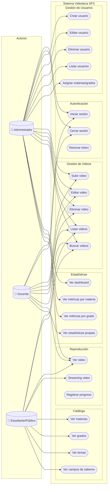
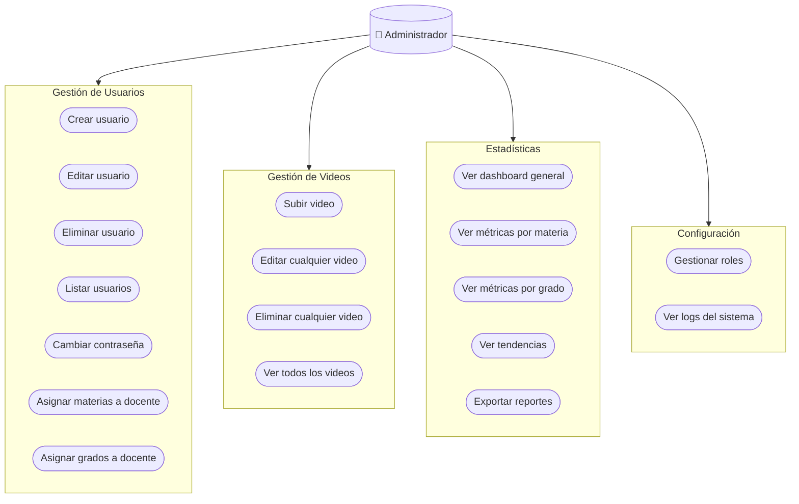
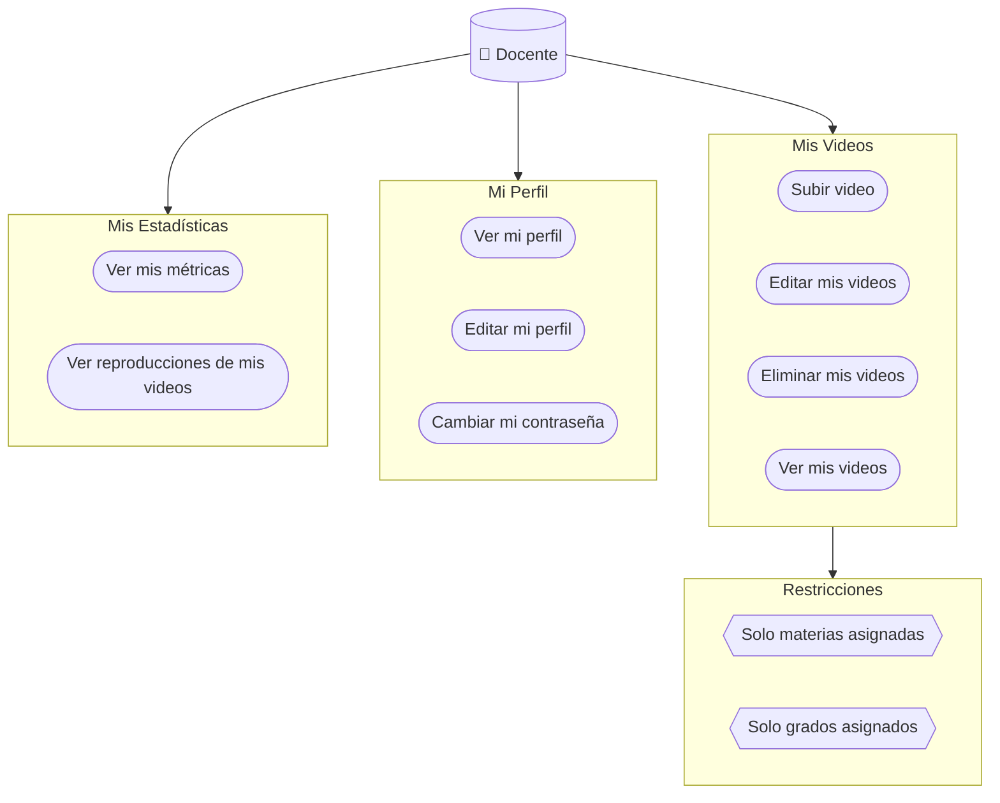
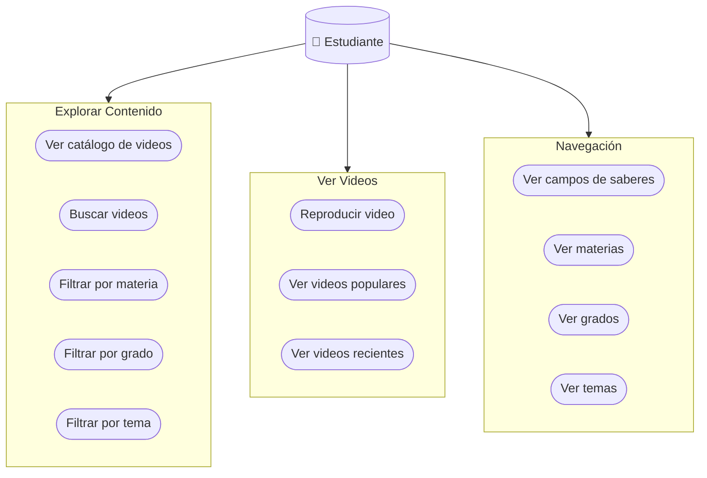
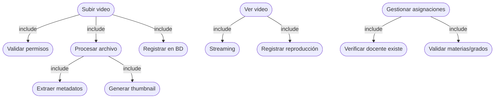

# Diagrama de Casos de Uso

## Sistema Completo

## Casos de Uso por Actor

### Administrador

### Docente

### Estudiante/Público

## Matriz de Permisos

| Caso de Uso | Admin | Docente | Público |
|-------------|:-----:|:-------:|:-------:|
| **Autenticación** |
| Iniciar sesión | ✅ | ✅ | ❌ |
| Cerrar sesión | ✅ | ✅ | ❌ |
| **Usuarios** |
| Crear usuario | ✅ | ❌ | ❌ |
| Editar usuario | ✅ | Solo propio | ❌ |
| Eliminar usuario | ✅ | ❌ | ❌ |
| Asignar materias/grados | ✅ | ❌ | ❌ |
| **Videos** |
| Subir video | ✅ | ✅* | ❌ |
| Editar video | ✅ | Solo propios | ❌ |
| Eliminar video | ✅ | Solo propios | ❌ |
| Ver videos | ✅ | ✅ | ✅ |
| Buscar videos | ✅ | ✅ | ✅ |
| **Estadísticas** |
| Ver dashboard | ✅ | ❌ | ❌ |
| Ver métricas generales | ✅ | ❌ | ❌ |
| Ver estadísticas propias | ✅ | ✅ | ❌ |

*Solo para materias y grados asignados

## Relaciones entre Casos de Uso

