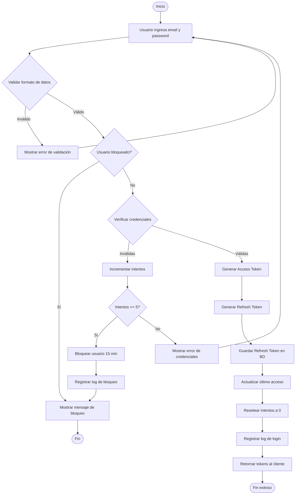
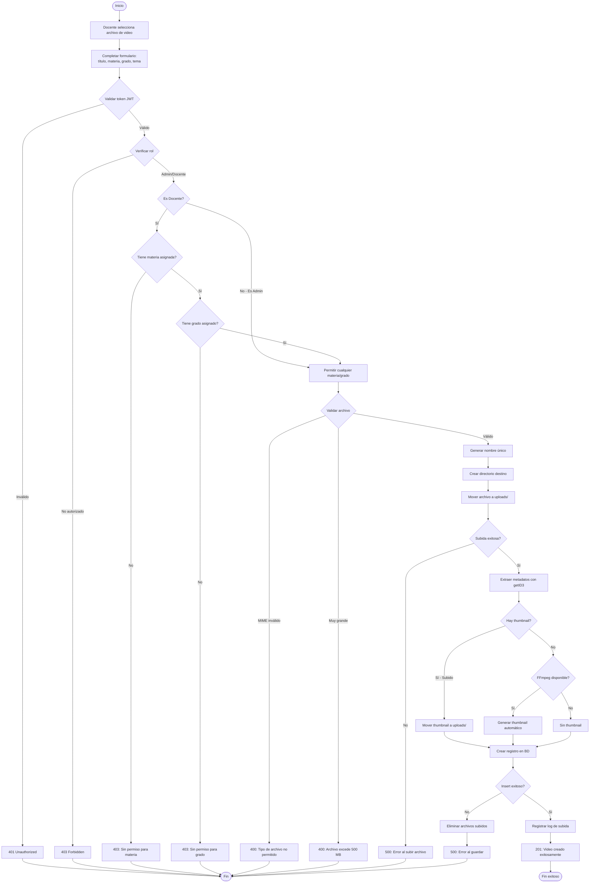
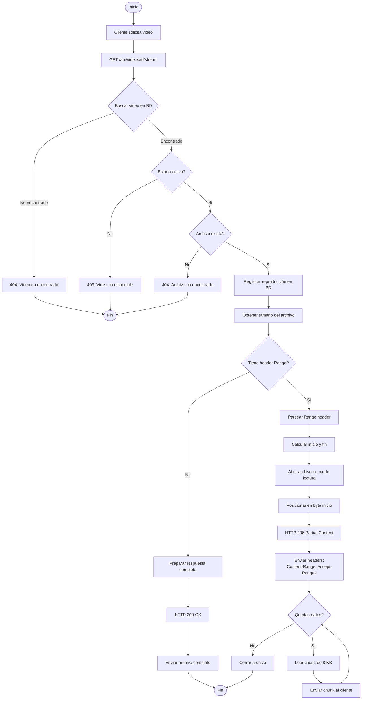
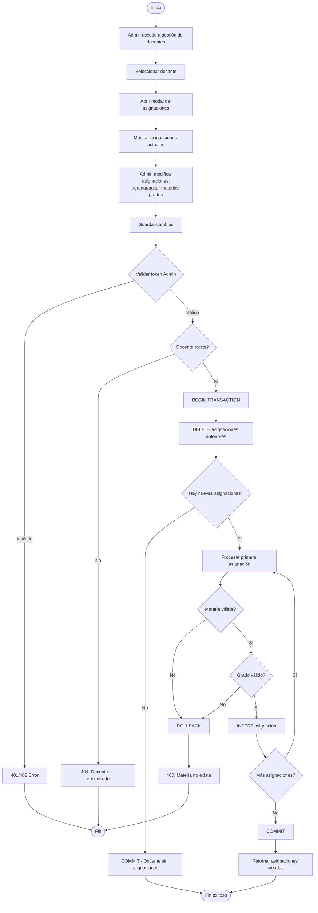
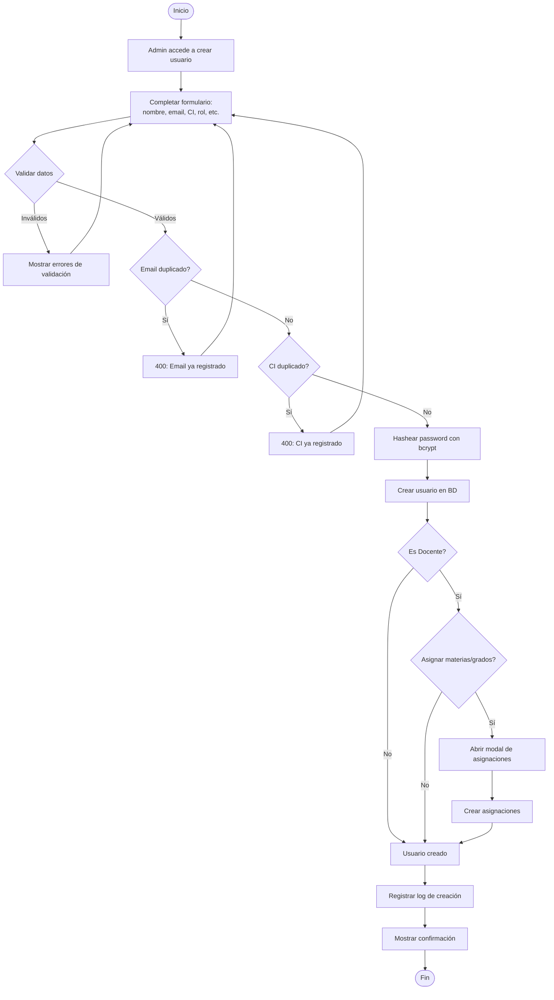
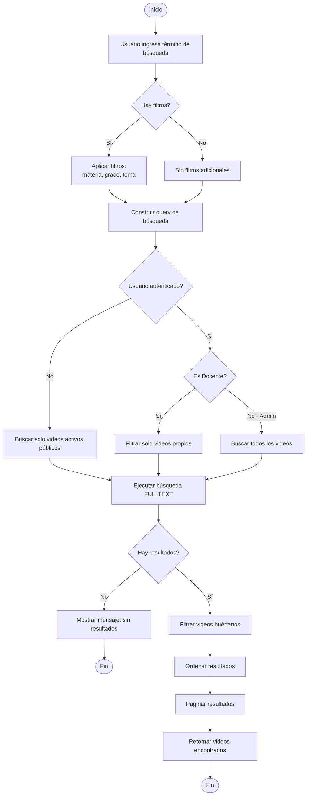

# Diagramas de Actividades

## Proceso de Autenticación

## Proceso de Subida de Video

## Proceso de Streaming de Video

## Proceso de Asignación de Docente

## Proceso de Registro de Usuario

## Proceso de Búsqueda de Videos

## Leyenda

| Símbolo | Significado |
|---------|-------------|
| ⬭ Óvalo | Inicio/Fin |
| ▭ Rectángulo | Actividad/Acción |
| ◇ Rombo | Decisión |
| → Flecha | Flujo de control |
