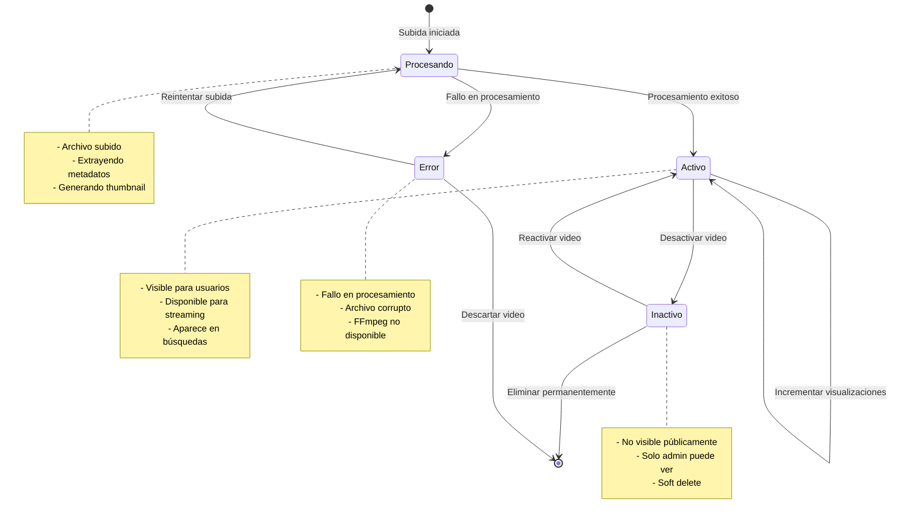
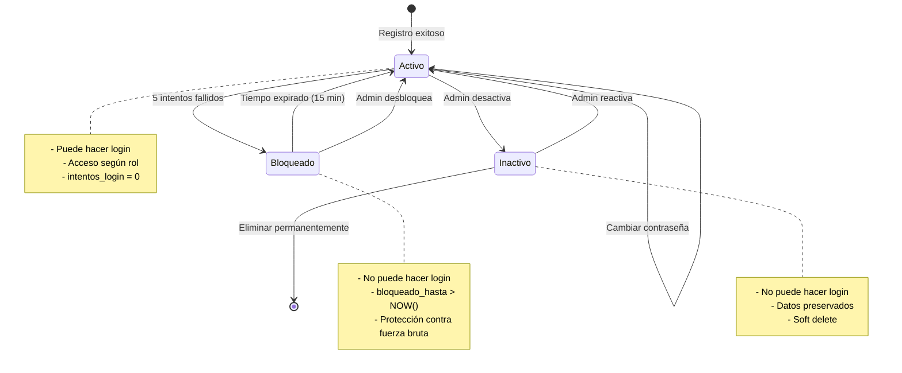
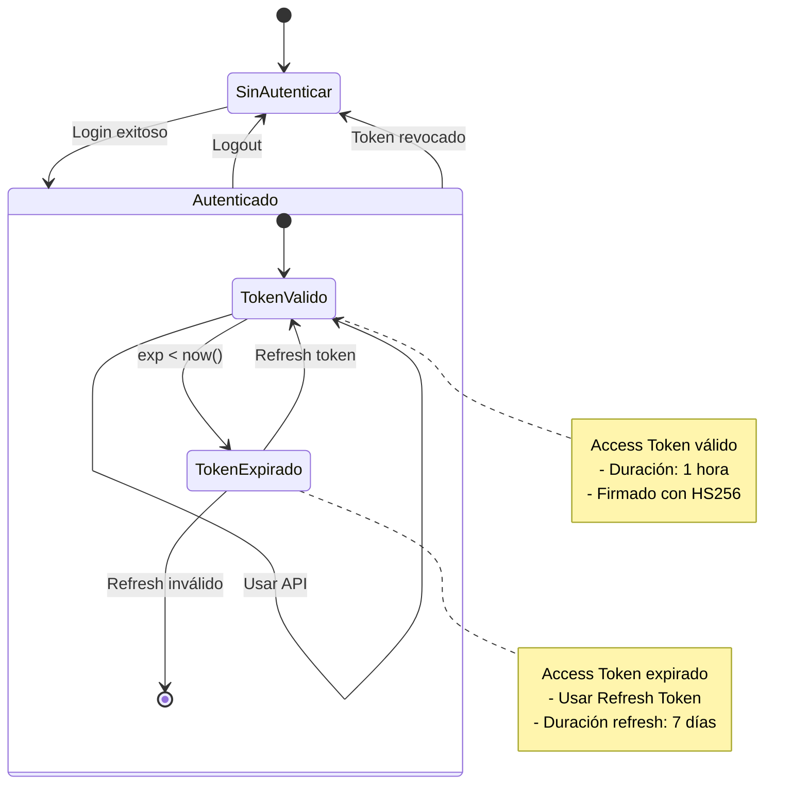
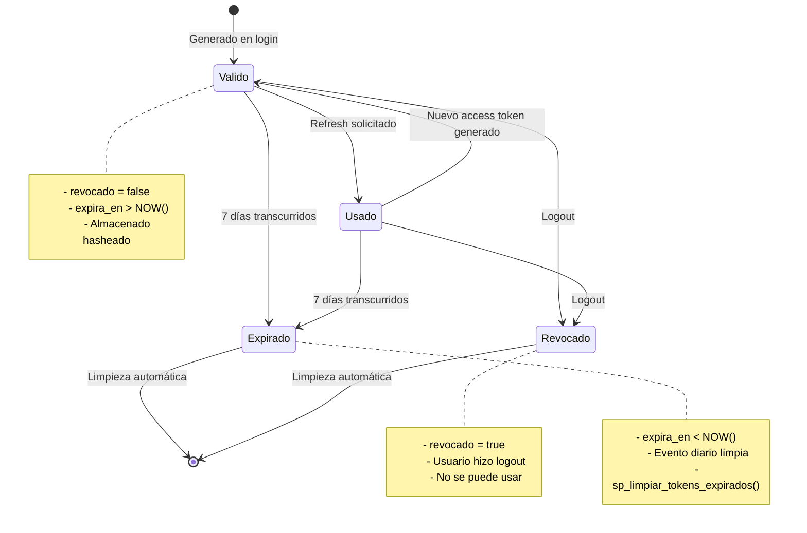
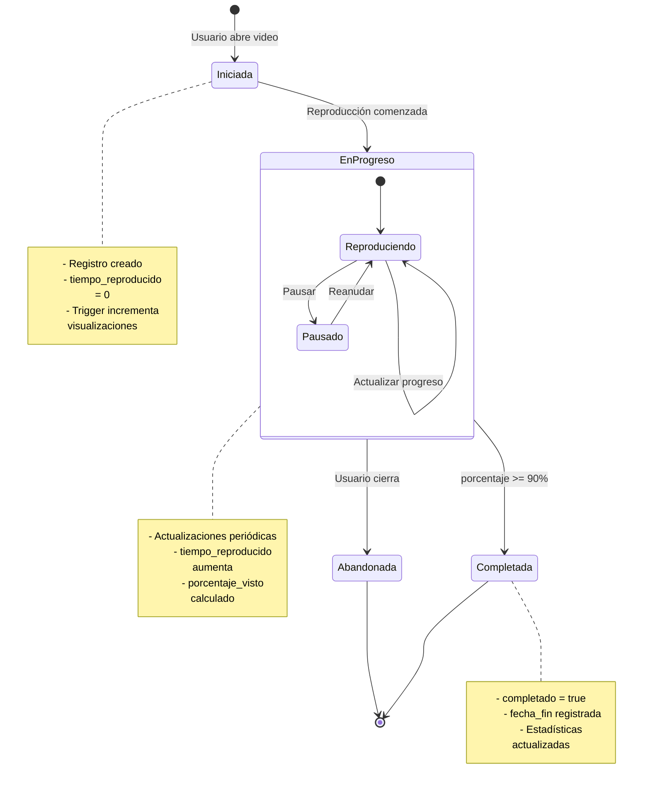
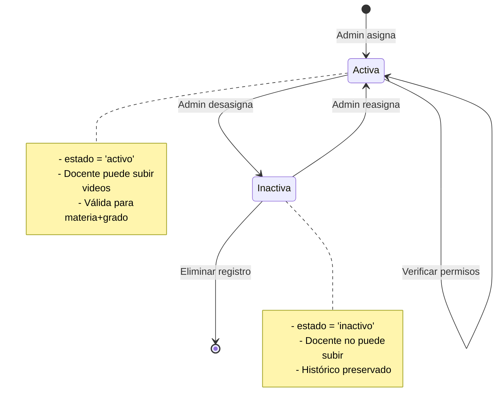
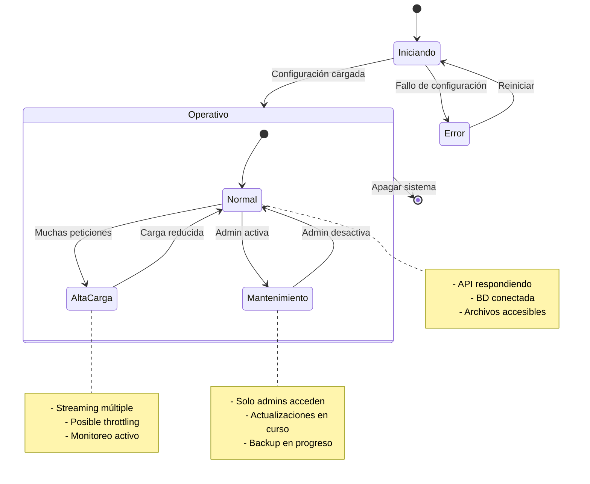

# Diagramas de Estados

## Estado de Video

## Estado de Usuario

## Estado de Sesión (Token)

## Estado de Refresh Token

## Estado de Reproducción

## Estado de Asignación

## Estado del Sistema (General)

## Tabla de Estados por Entidad

| Entidad | Estados | Transiciones Principales |
|---------|---------|--------------------------|
| **Video** | procesando, activo, inactivo, error | subir→procesar→activar |
| **Usuario** | activo, bloqueado, inactivo | registrar→activar, login fallido→bloquear |
| **Token** | válido, expirado, revocado | crear→usar→expirar/revocar |
| **Reproducción** | iniciada, en_progreso, completada, abandonada | abrir→reproducir→completar |
| **Asignación** | activa, inactiva | asignar→activar, desasignar→inactivar |

## Eventos Automáticos

| Evento | Disparador | Resultado |
|--------|------------|-----------|
| Bloqueo de usuario | 5 intentos fallidos | estado → bloqueado por 15 min |
| Desbloqueo | Tiempo expirado | estado → activo |
| Expiración de token | exp < NOW() | Requiere refresh |
| Limpieza de tokens | Evento diario | Elimina tokens expirados |
| Incremento visualizaciones | Nueva reproducción | Trigger actualiza contador |
