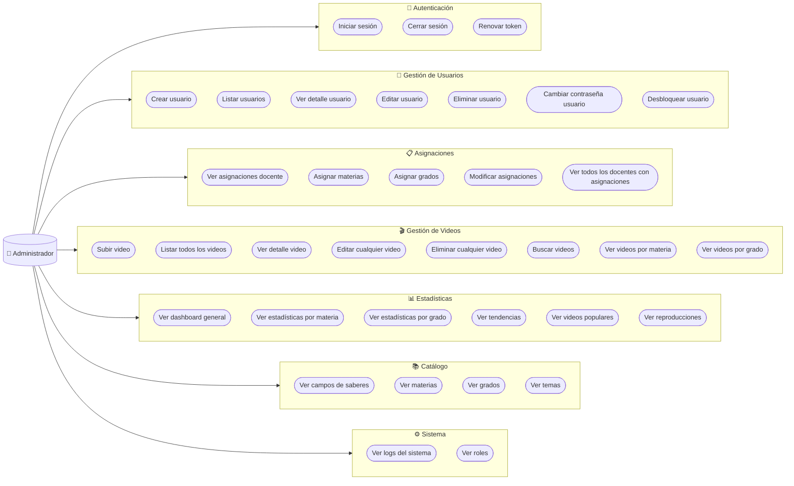
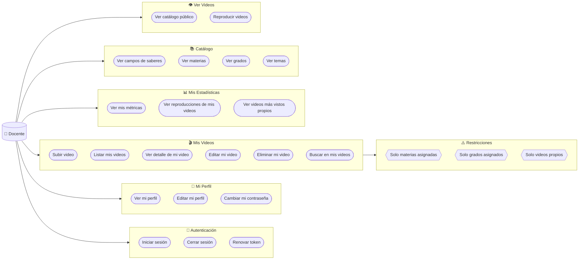
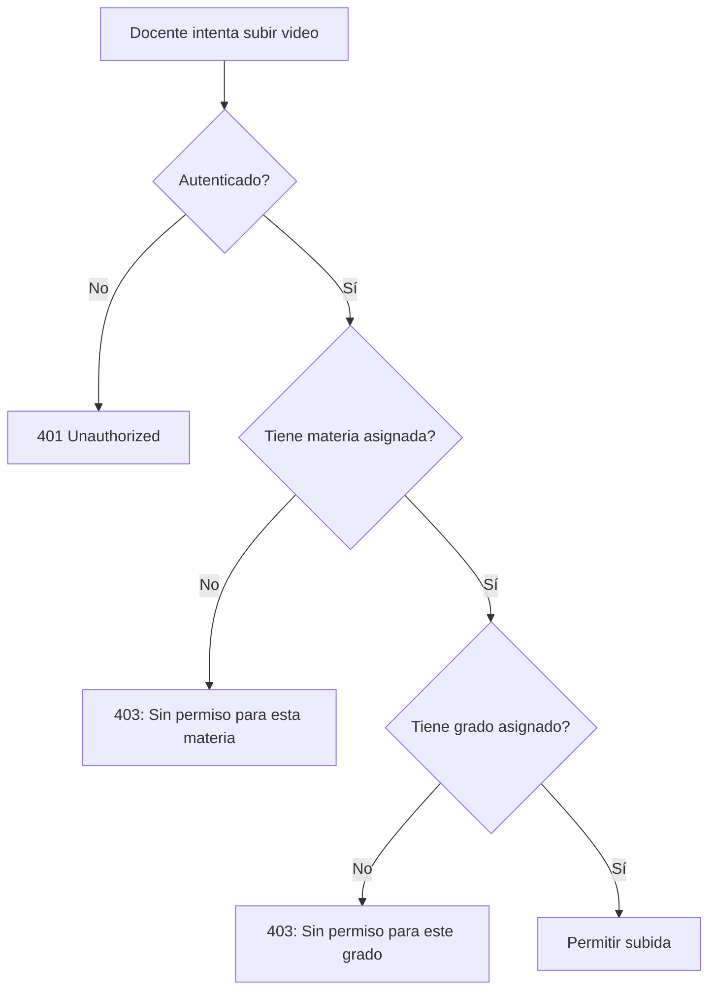
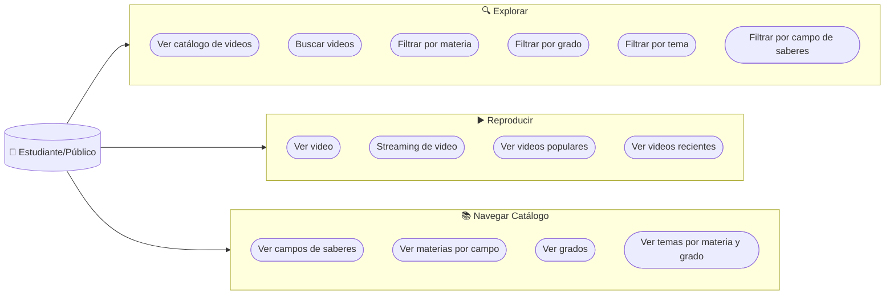
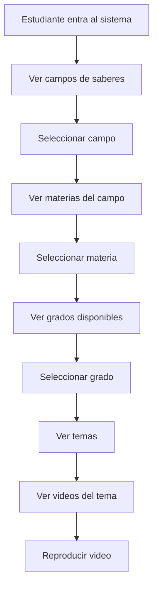
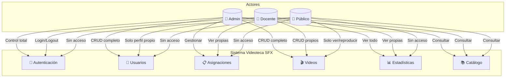

# Casos de Uso por Actor

## Administrador

### Descripción de Casos de Uso - Administrador

| Caso de Uso | Descripción | Precondición |
|-------------|-------------|--------------|
| **Crear usuario** | Registrar nuevo admin o docente | Autenticado como Admin |
| **Editar usuario** | Modificar datos de cualquier usuario | Usuario existe |
| **Eliminar usuario** | Desactivar usuario (soft delete) | No puede eliminarse a sí mismo |
| **Asignar materias** | Asignar materias a un docente | Docente existe |
| **Asignar grados** | Asignar grados a un docente | Docente existe |
| **Subir video** | Subir video para cualquier materia/grado | Archivo válido |
| **Editar cualquier video** | Modificar metadatos de cualquier video | Video existe |
| **Eliminar cualquier video** | Desactivar cualquier video | Video existe |
| **Ver dashboard** | Visualizar métricas generales | Autenticado |
| **Ver logs** | Auditar acciones del sistema | Autenticado |

---

## Docente

### Descripción de Casos de Uso - Docente

| Caso de Uso | Descripción | Restricción |
|-------------|-------------|-------------|
| **Subir video** | Subir video educativo | Solo para materias y grados asignados |
| **Editar mi video** | Modificar metadatos de video propio | Solo videos propios |
| **Eliminar mi video** | Desactivar video propio | Solo videos propios |
| **Ver mis videos** | Listar solo videos subidos por mí | Filtro automático docente_id |
| **Ver mis métricas** | Estadísticas de mis videos | Solo datos propios |
| **Editar mi perfil** | Modificar mis datos personales | Solo datos propios |
| **Cambiar mi contraseña** | Requiere contraseña actual | Verificación de password actual |

### Validación de Permisos al Subir Video

---

## Estudiante / Público

### Descripción de Casos de Uso - Estudiante/Público

| Caso de Uso | Descripción | Autenticación |
|-------------|-------------|---------------|
| **Ver catálogo** | Listar videos activos disponibles | No requerida |
| **Buscar videos** | Búsqueda FULLTEXT en título y descripción | No requerida |
| **Filtrar videos** | Aplicar filtros por materia, grado, tema | No requerida |
| **Ver video** | Reproducir video educativo | No requerida |
| **Streaming** | Reproducción con Range Requests | No requerida |
| **Ver populares** | Top videos por visualizaciones | No requerida |
| **Ver recientes** | Últimos videos subidos | No requerida |
| **Navegar catálogo** | Explorar estructura curricular | No requerida |

### Flujo de Navegación

---

## Matriz Completa de Permisos

| Caso de Uso | Admin | Docente | Público |
|-------------|:-----:|:-------:|:-------:|
| **AUTENTICACIÓN** |
| Iniciar sesión | ✅ | ✅ | ❌ |
| Cerrar sesión | ✅ | ✅ | ❌ |
| Renovar token | ✅ | ✅ | ❌ |
| **USUARIOS** |
| Crear usuario | ✅ | ❌ | ❌ |
| Listar usuarios | ✅ | ❌ | ❌ |
| Ver detalle usuario | ✅ | Solo propio | ❌ |
| Editar usuario | ✅ | Solo propio | ❌ |
| Eliminar usuario | ✅ | ❌ | ❌ |
| Cambiar contraseña | ✅ | Solo propia* | ❌ |
| **ASIGNACIONES** |
| Ver asignaciones | ✅ | Solo propias | ❌ |
| Asignar materias/grados | ✅ | ❌ | ❌ |
| Modificar asignaciones | ✅ | ❌ | ❌ |
| **VIDEOS** |
| Subir video | ✅ | ✅** | ❌ |
| Listar videos | ✅ (todos) | ✅ (propios) | ✅ (activos) |
| Ver detalle | ✅ | ✅ | ✅ |
| Editar video | ✅ (todos) | ✅ (propios) | ❌ |
| Eliminar video | ✅ (todos) | ✅ (propios) | ❌ |
| Buscar videos | ✅ | ✅ | ✅ |
| Reproducir video | ✅ | ✅ | ✅ |
| **ESTADÍSTICAS** |
| Ver dashboard | ✅ | ❌ | ❌ |
| Ver métricas generales | ✅ | ❌ | ❌ |
| Ver métricas propias | ✅ | ✅ | ❌ |
| **CATÁLOGO** |
| Ver campos | ✅ | ✅ | ✅ |
| Ver materias | ✅ | ✅ | ✅ |
| Ver grados | ✅ | ✅ | ✅ |
| Ver temas | ✅ | ✅ | ✅ |

*Docente requiere contraseña actual para cambiar
**Solo para materias y grados asignados

---

## Diagrama General del Sistema

