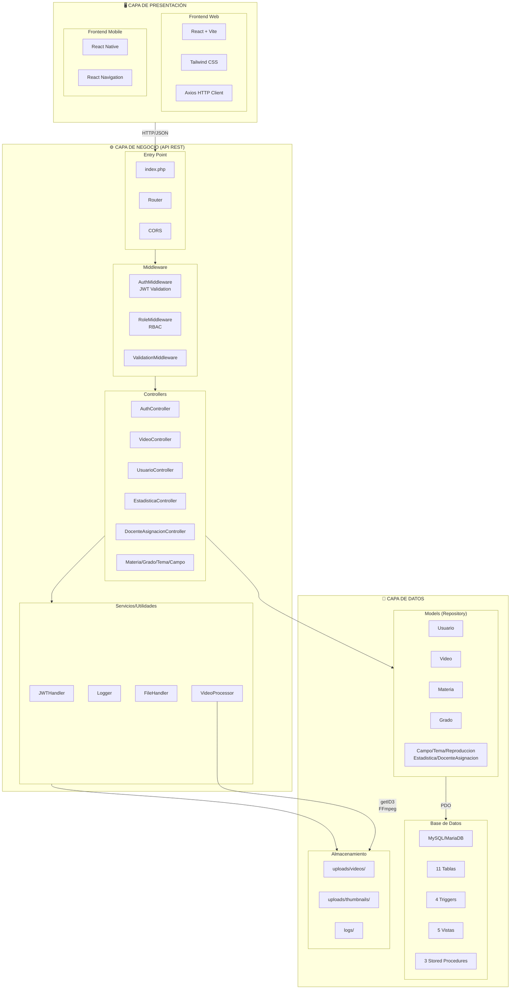
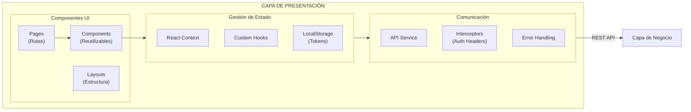
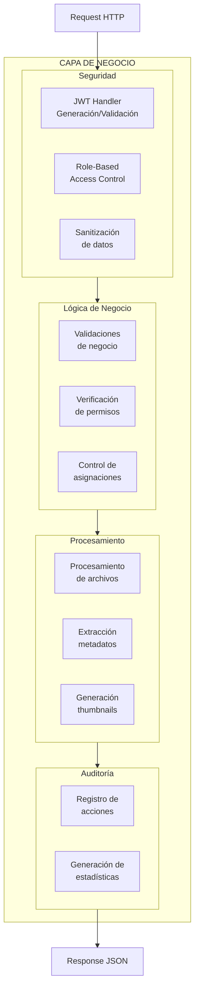
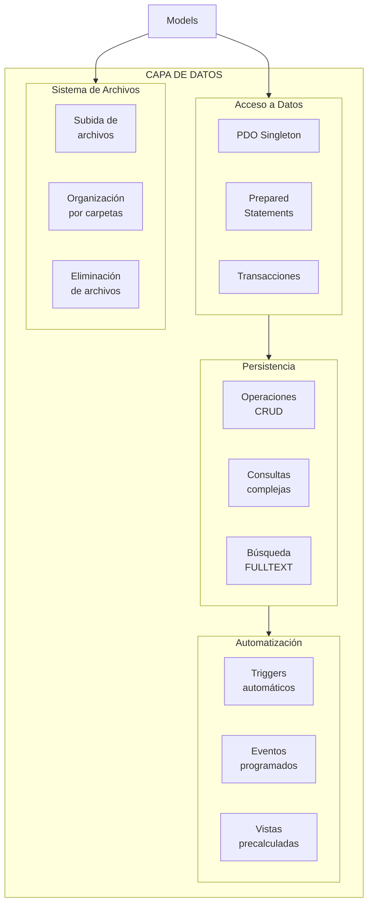
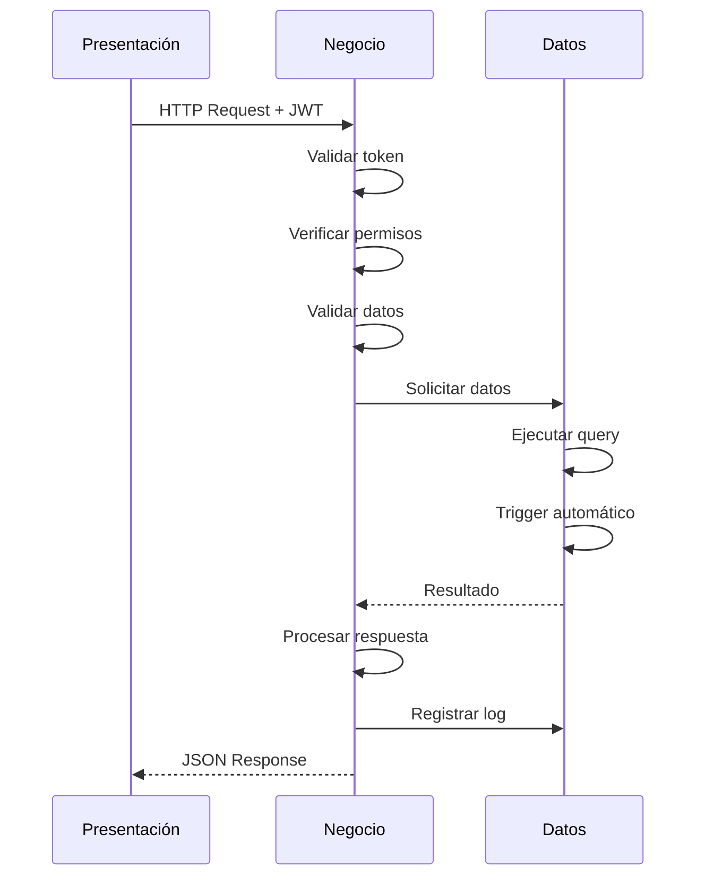

# Diagrama de Arquitectura 3 Capas

## Arquitectura General

## Detalle por Capa

### Capa de Presentación

**Responsabilidades:**
- Renderizado de interfaz de usuario
- Gestión de estado local
- Validación de formularios (cliente)
- Manejo de rutas/navegación
- Almacenamiento de tokens JWT
- Interceptores para headers de autenticación

### Capa de Negocio

**Responsabilidades:**
- Autenticación y autorización
- Validación de reglas de negocio
- Control de permisos por rol
- Procesamiento de archivos multimedia
- Generación de tokens JWT
- Registro de auditoría
- Manejo de errores y excepciones

### Capa de Datos

**Responsabilidades:**
- Conexión a base de datos (Singleton)
- Operaciones CRUD con prepared statements
- Transacciones atómicas
- Búsquedas FULLTEXT
- Triggers para auditoría automática
- Eventos programados (limpieza, estadísticas)
- Gestión del sistema de archivos

## Flujo de Datos

## Tecnologías por Capa

| Capa | Tecnología | Propósito |
|------|------------|-----------|
| **Presentación** | React | UI Web |
| | React Native | UI Mobile |
| | Tailwind CSS | Estilos |
| | Axios | HTTP Client |
| **Negocio** | PHP 8.x | Lógica |
| | JWT (HS256) | Autenticación |
| | getID3 | Metadatos |
| | FFmpeg | Thumbnails |
| **Datos** | MySQL/MariaDB | Base de datos |
| | PDO | Conexión |
| | File System | Archivos |

## Principios de Diseño

| Principio | Implementación |
|-----------|----------------|
| **Separación de responsabilidades** | Cada capa tiene funciones específicas |
| **Bajo acoplamiento** | Capas se comunican por interfaces definidas |
| **Alta cohesión** | Componentes relacionados agrupados |
| **Seguridad en capas** | Validación en presentación, negocio y datos |
| **Escalabilidad** | Cada capa puede escalar independientemente |
