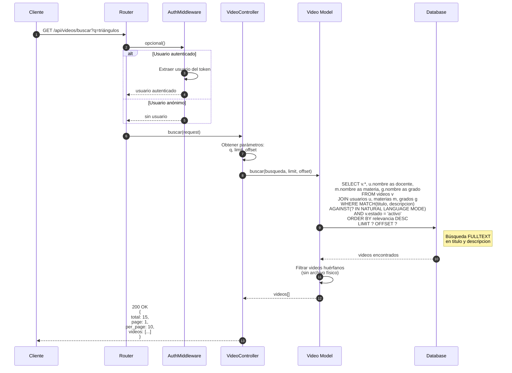
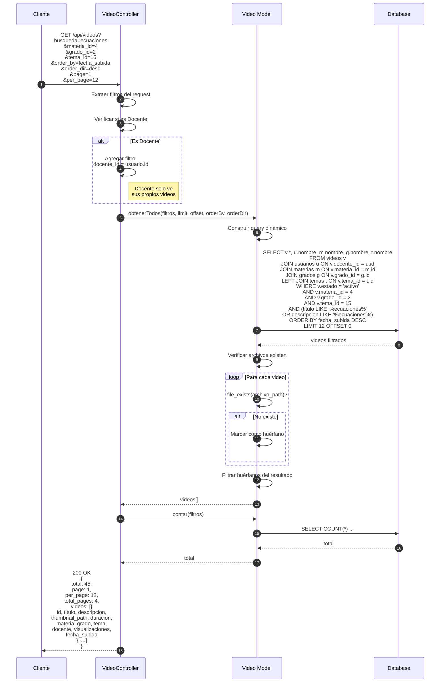
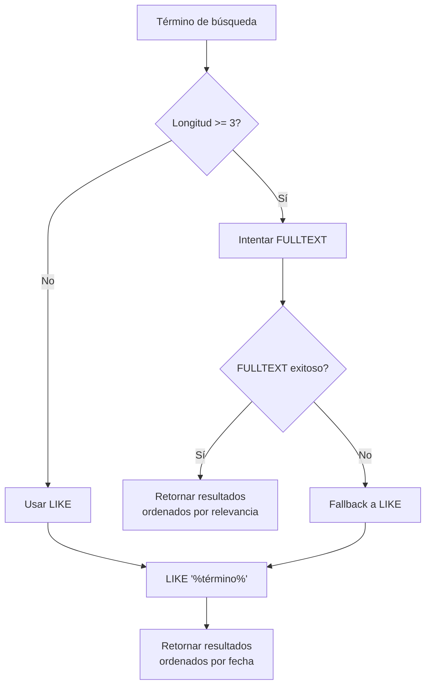
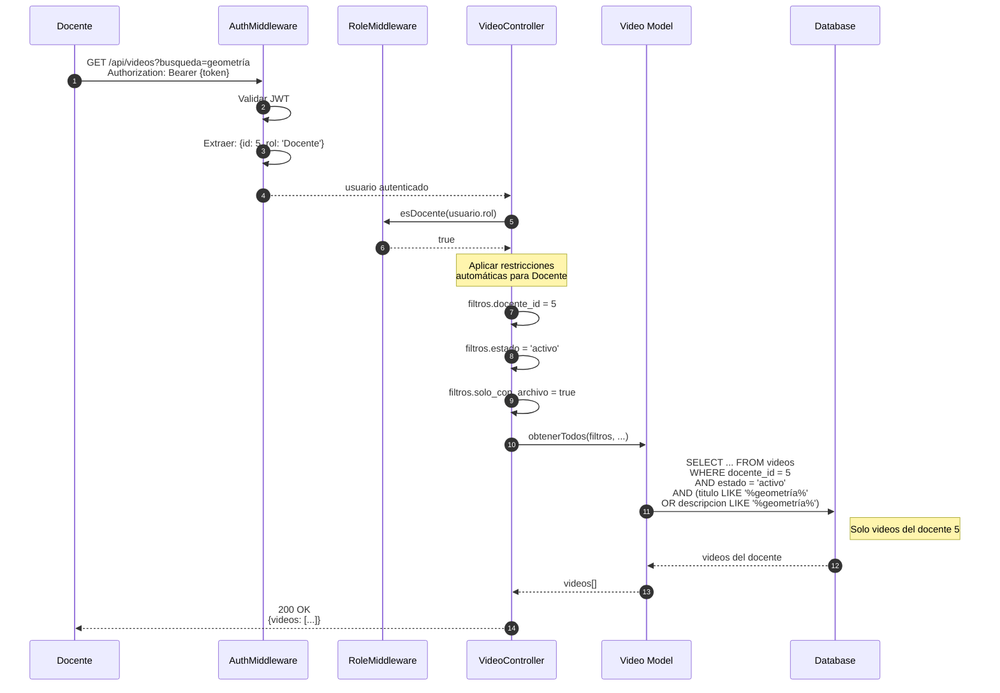
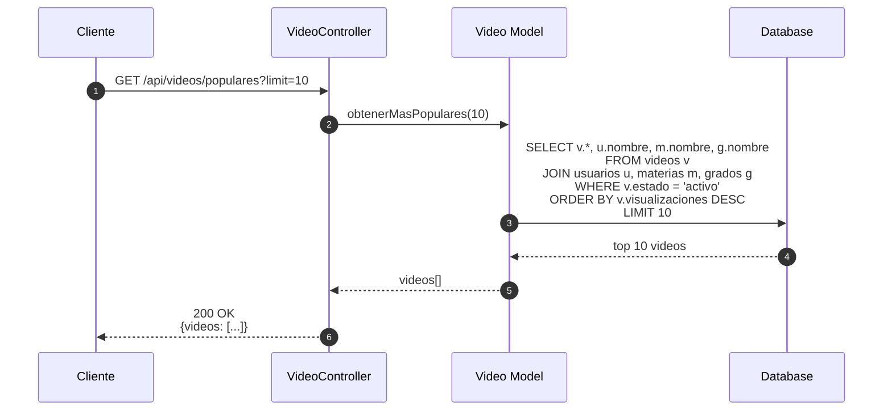
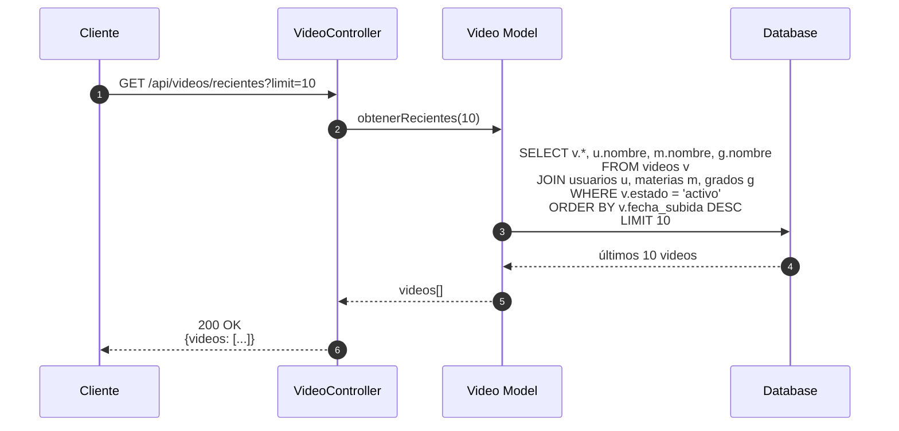

# Diagrama de Secuencia - Búsqueda de Videos

## Búsqueda Simple



## Búsqueda con Filtros



## Búsqueda FULLTEXT vs LIKE



## Búsqueda por Docente (Restringida)



## Búsqueda de Videos Populares



## Búsqueda de Videos Recientes



## Índice FULLTEXT

```sql
-- Índice FULLTEXT para búsquedas eficientes
ALTER TABLE videos
ADD FULLTEXT INDEX idx_fulltext_videos (titulo, descripcion);

-- Consulta FULLTEXT
SELECT *,
       MATCH(titulo, descripcion) AGAINST('triángulos' IN NATURAL LANGUAGE MODE) as relevancia
FROM videos
WHERE MATCH(titulo, descripcion) AGAINST('triángulos' IN NATURAL LANGUAGE MODE)
ORDER BY relevancia DESC;
```

## Parámetros de Búsqueda

| Parámetro | Tipo | Descripción | Ejemplo |
|-----------|------|-------------|---------|
| `busqueda` / `q` | string | Término de búsqueda | "ecuaciones" |
| `materia_id` | int | Filtrar por materia | 4 |
| `grado_id` | int | Filtrar por grado | 2 |
| `tema_id` | int | Filtrar por tema | 15 |
| `docente_id` | int | Filtrar por docente | 5 |
| `estado` | string | Estado del video | "activo" |
| `order_by` | string | Campo de ordenación | "fecha_subida" |
| `order_dir` | string | Dirección | "desc" |
| `page` | int | Página actual | 1 |
| `per_page` | int | Videos por página | 12 |

## Respuesta de Búsqueda

```json
{
  "success": true,
  "total": 45,
  "page": 1,
  "per_page": 12,
  "total_pages": 4,
  "videos": [
    {
      "id": 123,
      "titulo": "Ecuaciones de primer grado",
      "descripcion": "Introducción a las ecuaciones...",
      "thumbnail_path": "thumbnails/123.jpg",
      "duracion": 480,
      "formato": "mp4",
      "resolucion": "1920x1080",
      "materia": "Matemáticas",
      "materia_id": 4,
      "grado": "2° Secundaria",
      "grado_id": 2,
      "tema": "Ecuaciones",
      "tema_id": 15,
      "docente": "Juan Pérez",
      "docente_id": 5,
      "visualizaciones": 342,
      "fecha_subida": "2025-01-15T10:30:00Z"
    }
  ]
}
```
