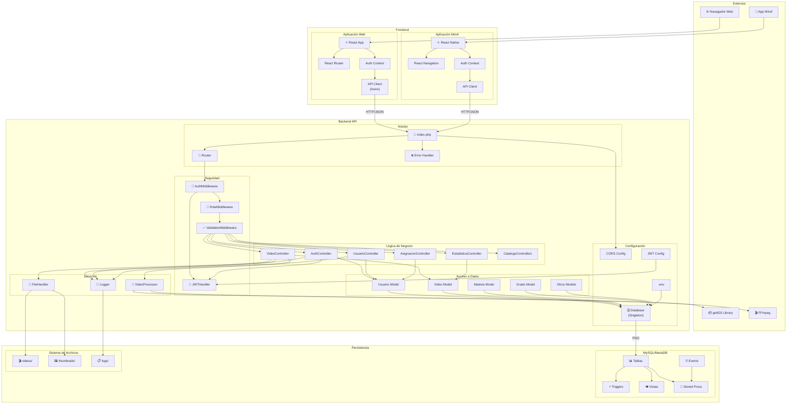
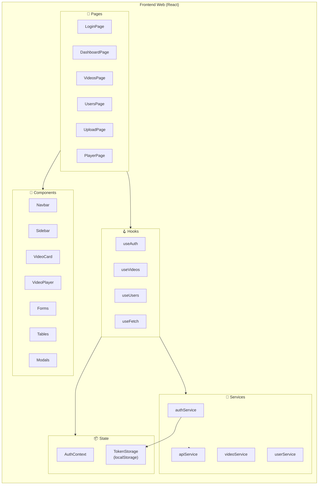
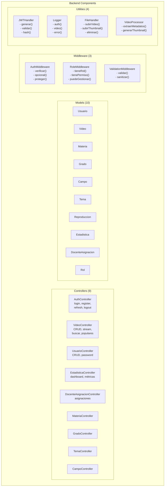
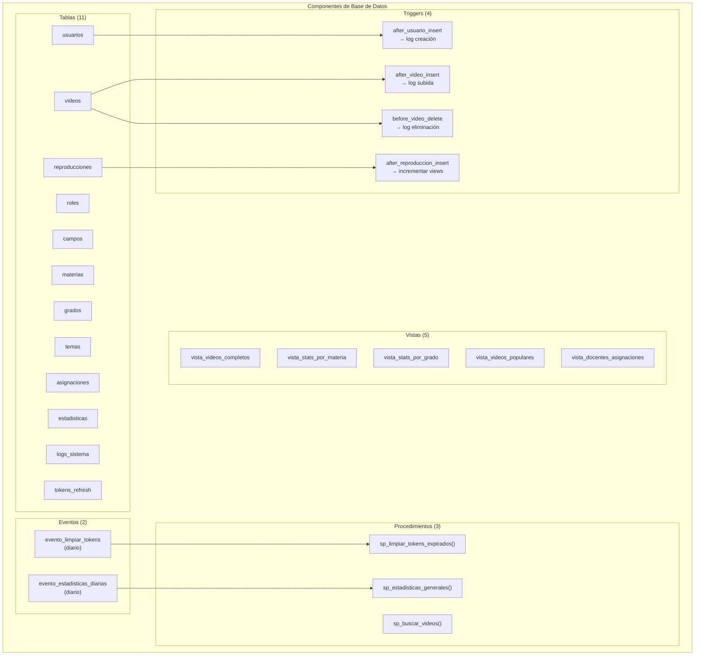
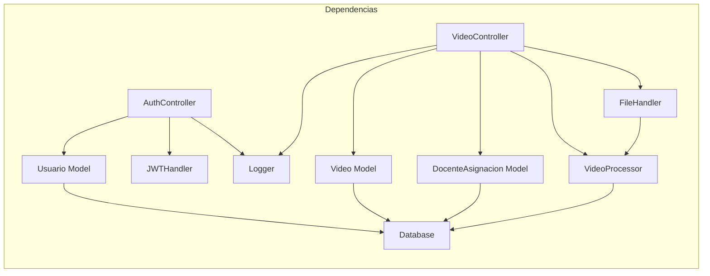
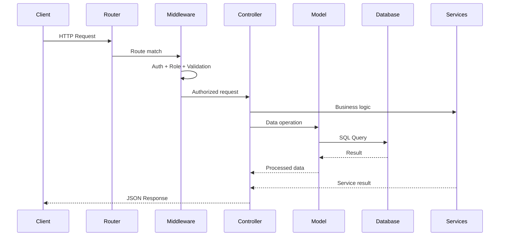

# Diagrama de Componentes

## Vista General del Sistema

## Componentes del Frontend

## Componentes del Backend

## Componentes de Base de Datos

## Dependencias entre Componentes

## Interfaces de Componentes

| Componente | Interface | Métodos Principales |
|------------|-----------|---------------------|
| **AuthController** | REST API | login(), register(), refresh(), logout(), me() |
| **VideoController** | REST API | index(), store(), show(), update(), destroy(), stream(), buscar() |
| **AuthMiddleware** | Middleware | verificar(), opcional(), proteger(), protegerConRol() |
| **JWTHandler** | Service | generarAccessToken(), generarRefreshToken(), validarToken() |
| **FileHandler** | Service | subirVideo(), subirThumbnail(), eliminarVideo() |
| **VideoProcessor** | Service | extraerMetadatos(), generarThumbnail() |
| **Database** | Singleton | getInstance(), query(), beginTransaction(), commit() |
| **Logger** | Service | auth(), video(), usuario(), info(), error() |

## Comunicación entre Componentes

