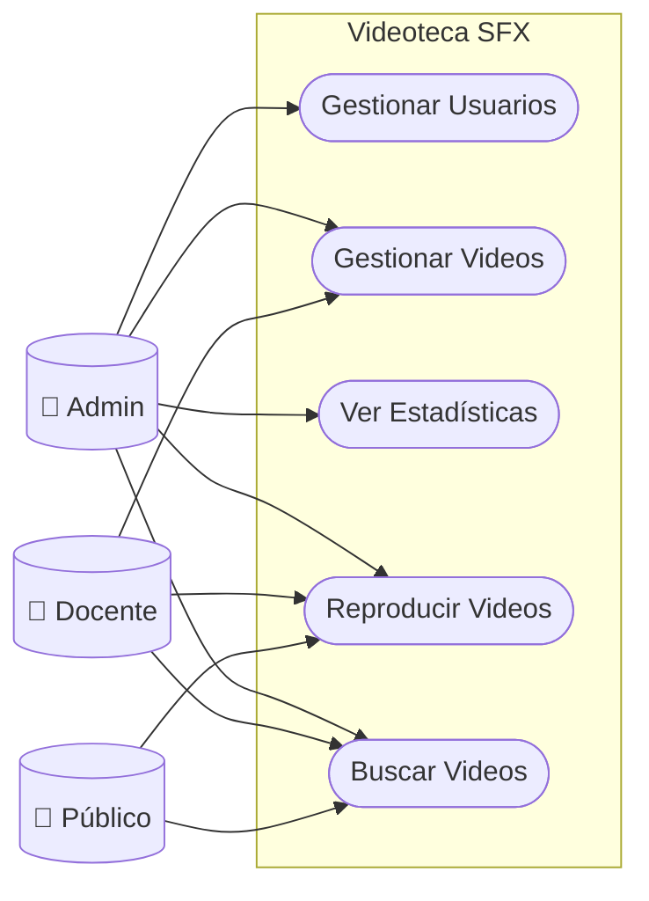
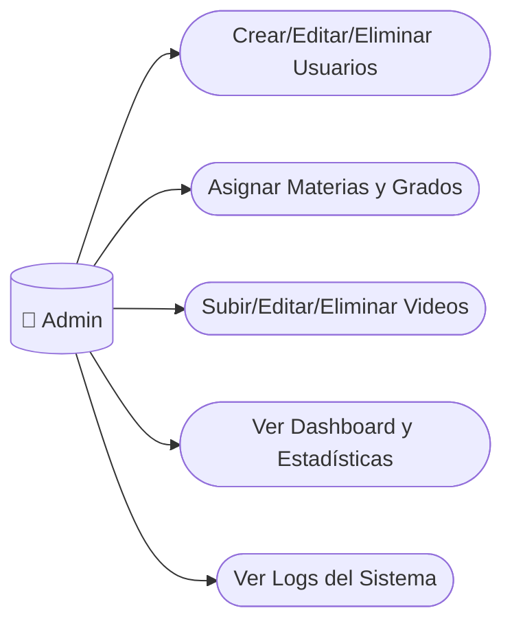
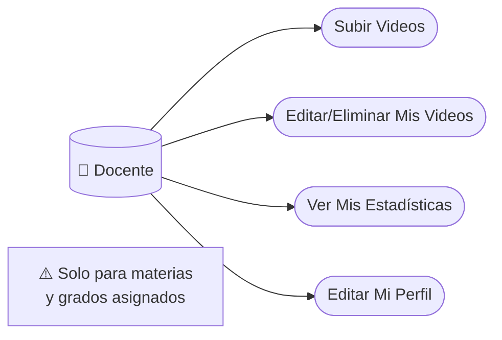
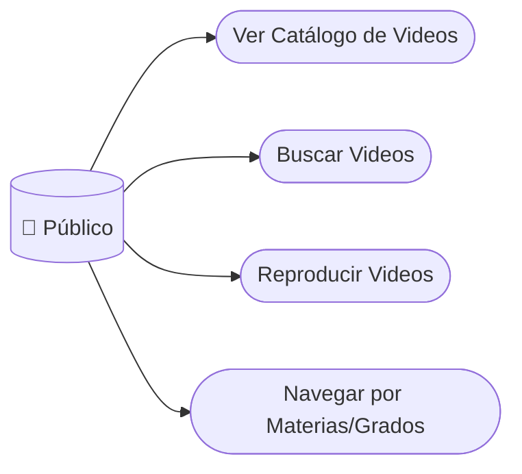

# Casos de Uso - Versión Simplificada

## Diagrama General

## Por Actor

### Administrador

### Docente

### Público/Estudiante

## Resumen de Permisos

| Función | Admin | Docente | Público |
|---------|:-----:|:-------:|:-------:|
| Gestionar usuarios | ✅ | ❌ | ❌ |
| Asignar materias/grados | ✅ | ❌ | ❌ |
| Subir videos | ✅ | ✅* | ❌ |
| Editar/eliminar videos | ✅ | Solo propios | ❌ |
| Ver estadísticas | ✅ | Solo propias | ❌ |
| Buscar/ver videos | ✅ | ✅ | ✅ |

*Solo para materias y grados asignados
