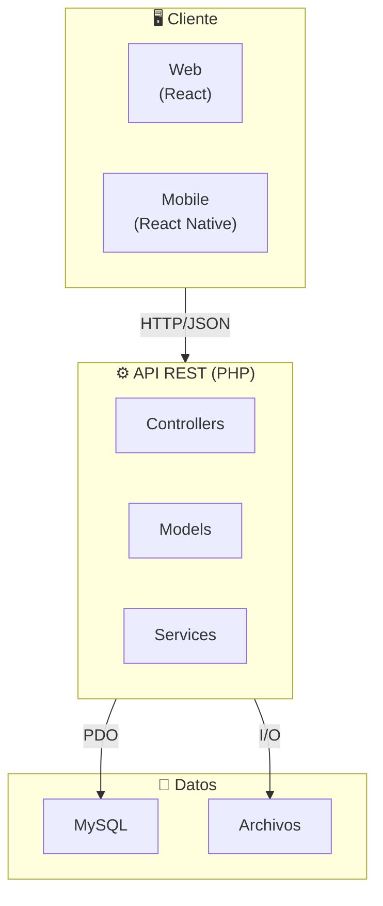
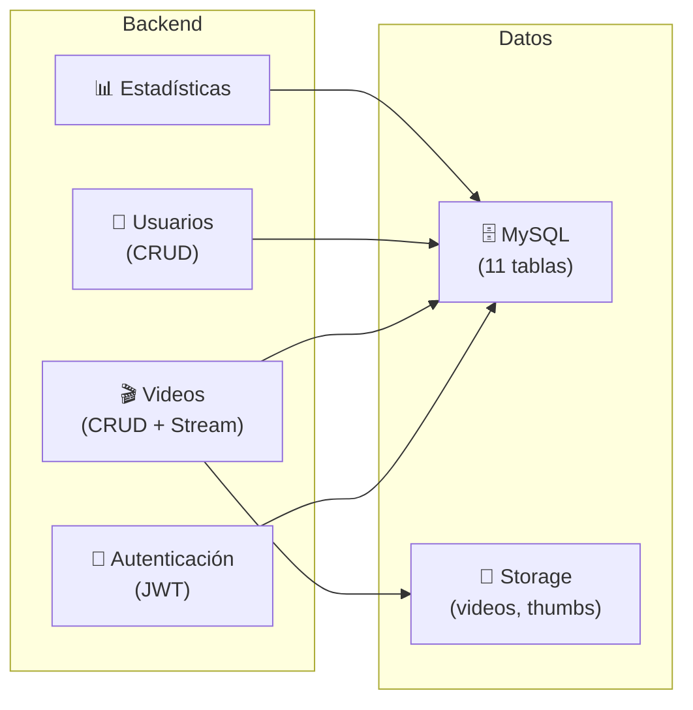
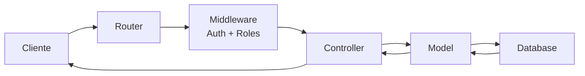

# Diagrama de Componentes - Versión Simplificada

## Vista General

## Componentes Principales

## Flujo de una Petición

## Resumen de Componentes

| Capa | Componentes | Cantidad |
|------|-------------|----------|
| **Frontend** | React, React Native | 2 apps |
| **API** | Controllers | 9 |
| | Models | 10 |
| | Middleware | 3 |
| | Servicios | 4 |
| **Base de Datos** | Tablas | 11 |
| | Triggers | 4 |
| | Vistas | 5 |
| **Almacenamiento** | Carpetas | videos, thumbnails, logs |
