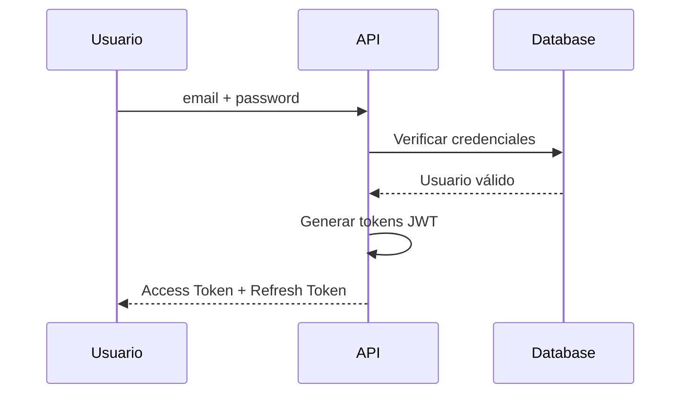
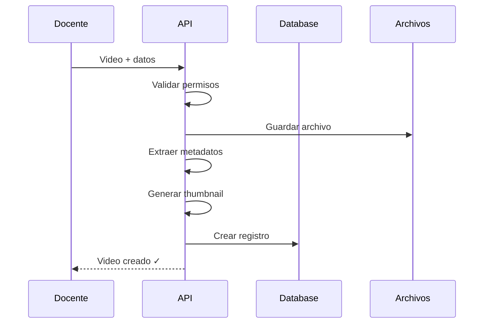
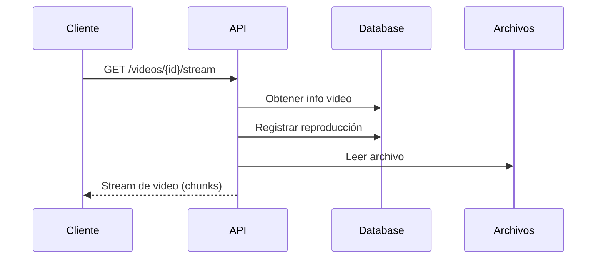
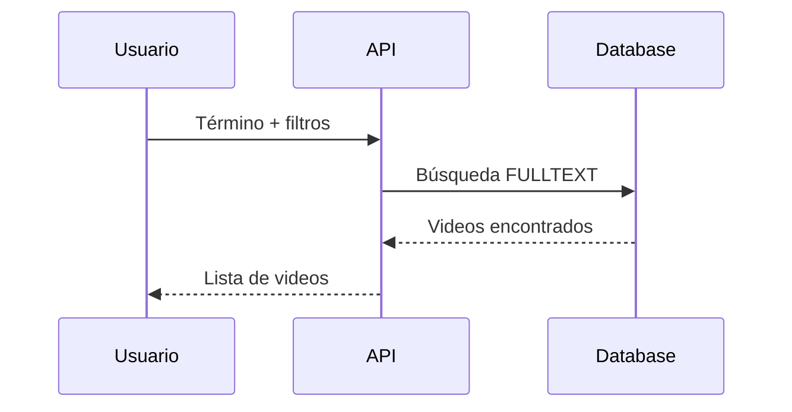
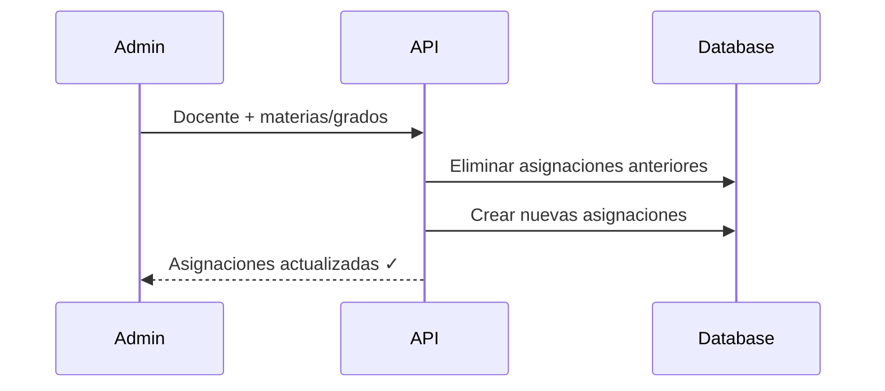
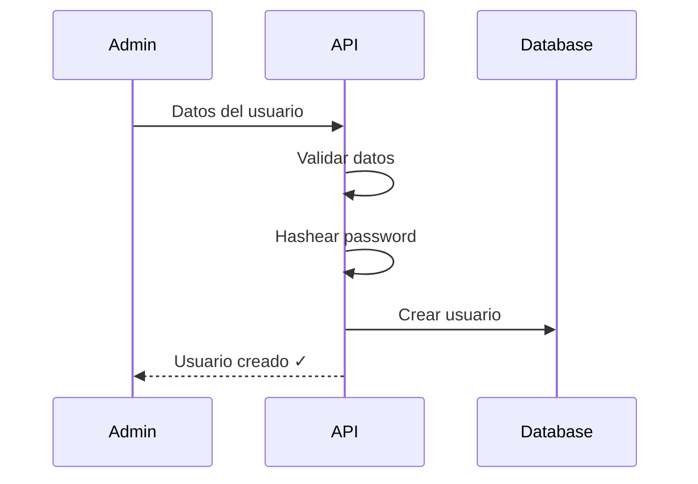
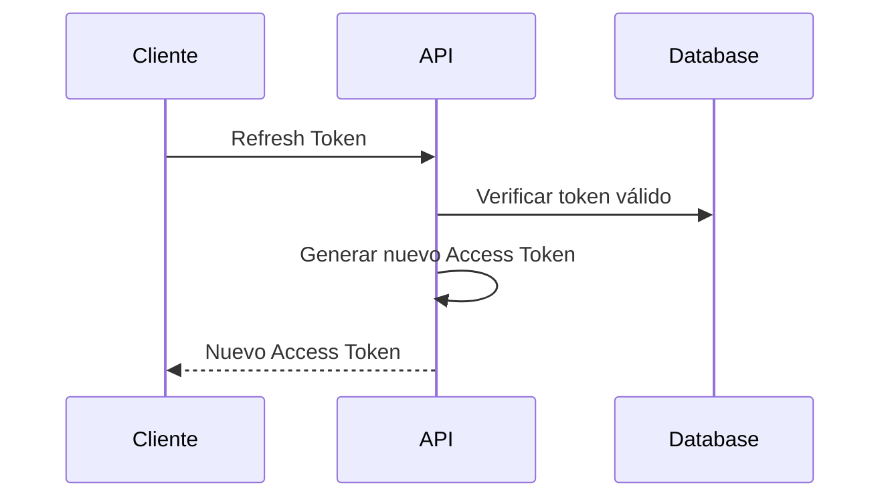
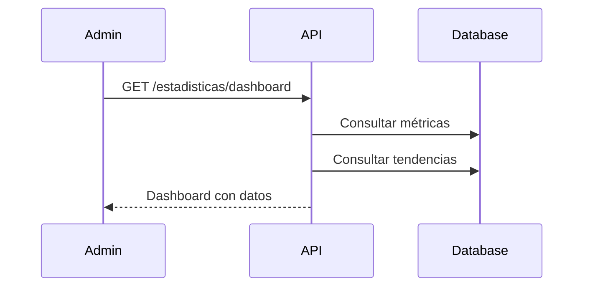

# Diagramas de Secuencia - Versión Simplificada

## Login

## Subida de Video

## Streaming de Video

## Búsqueda de Videos

## Asignación de Docente

## Registro de Usuario

## Refresh Token

## Ver Estadísticas

## Resumen de Flujos

| Flujo | Pasos | Resultado |
|-------|-------|-----------|
| Login | 4 | Tokens JWT |
| Subida Video | 7 | Video guardado |
| Streaming | 5 | Video reproducido |
| Búsqueda | 4 | Lista de videos |
| Asignación | 4 | Permisos actualizados |
| Registro | 5 | Usuario creado |
| Refresh | 4 | Token renovado |
| Dashboard | 4 | Métricas mostradas |
