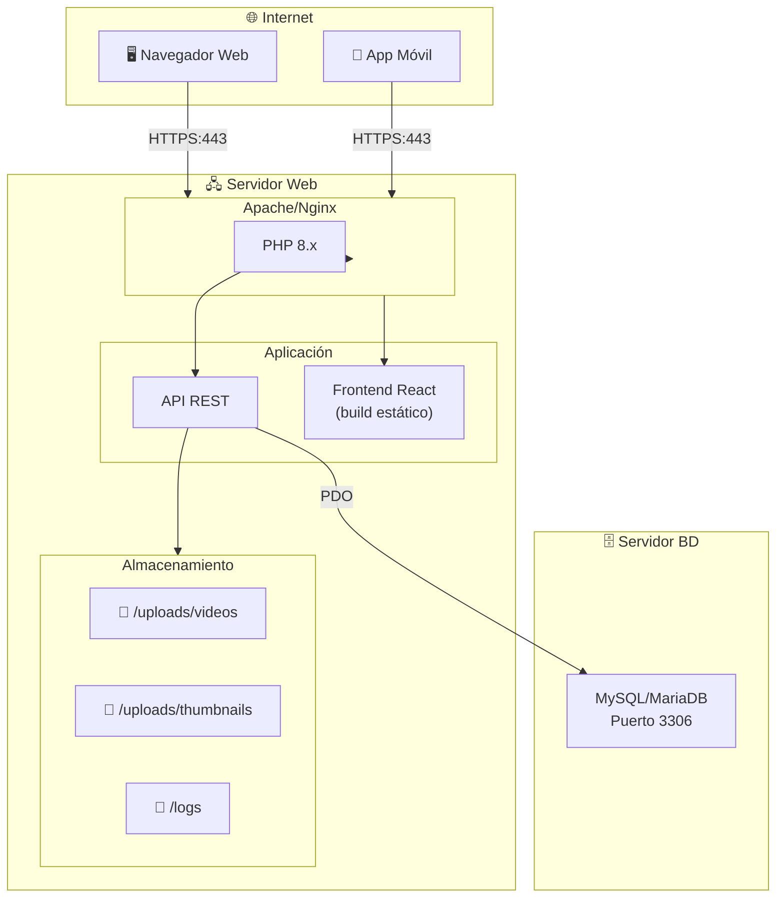
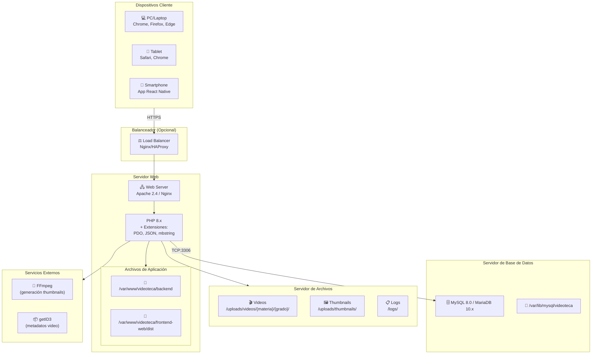

# Diagrama de Despliegue

## Infraestructura del Sistema



## Despliegue Detallado



## Configuración de Puertos

| Servicio | Puerto | Protocolo |
|----------|--------|-----------|
| HTTP | 80 | TCP |
| HTTPS | 443 | TCP |
| MySQL | 3306 | TCP |
| SSH | 22 | TCP |

## Requisitos del Servidor

### Servidor Web
- **OS:** Ubuntu 20.04+ / CentOS 8+
- **RAM:** 4 GB mínimo
- **CPU:** 2 cores mínimo
- **Disco:** 100 GB+ (para videos)
- **Software:**
  - Apache 2.4 o Nginx
  - PHP 8.0+
  - FFmpeg
  - getID3

### Servidor de Base de Datos
- **OS:** Ubuntu 20.04+ / CentOS 8+
- **RAM:** 2 GB mínimo
- **CPU:** 2 cores
- **Disco:** 20 GB
- **Software:**
  - MySQL 8.0+ o MariaDB 10.x

## Estructura de Directorios

```
/var/www/videoteca/
├── backend/
│   ├── config/
│   ├── controllers/
│   ├── middleware/
│   ├── models/
│   ├── routes/
│   ├── utils/
│   ├── uploads/
│   │   ├── videos/
│   │   └── thumbnails/
│   ├── logs/
│   └── index.php
├── frontend-web/
│   └── dist/
└── database/
    ├── schema.sql
    └── seed_data.sql
```
