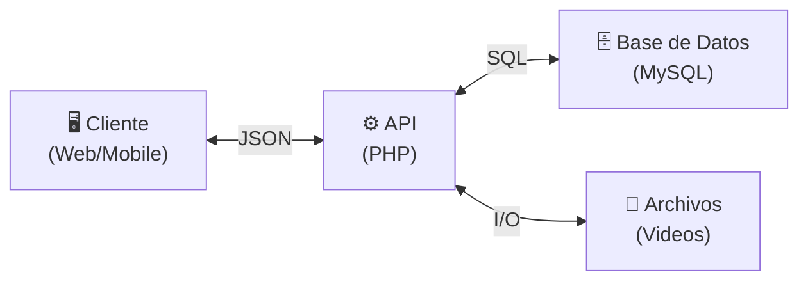
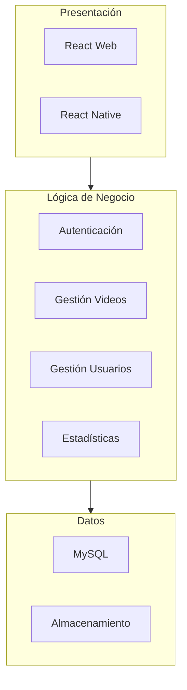
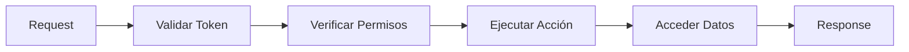
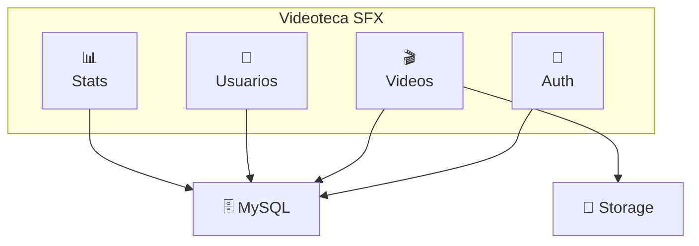

# Arquitectura - Versión Simplificada

## Vista General

## Capas del Sistema

## Flujo de Datos

## Componentes Clave

## Tecnologías

| Capa | Tecnología |
|------|------------|
| Frontend | React, React Native |
| Backend | PHP 8.x |
| Base de Datos | MySQL/MariaDB |
| Autenticación | JWT |
| Almacenamiento | Sistema de archivos |

## Patrones Utilizados

- **MVC** - Separación de responsabilidades
- **REST** - API stateless
- **Repository** - Acceso a datos
- **Singleton** - Conexión BD
- **Middleware** - Seguridad en cadena
