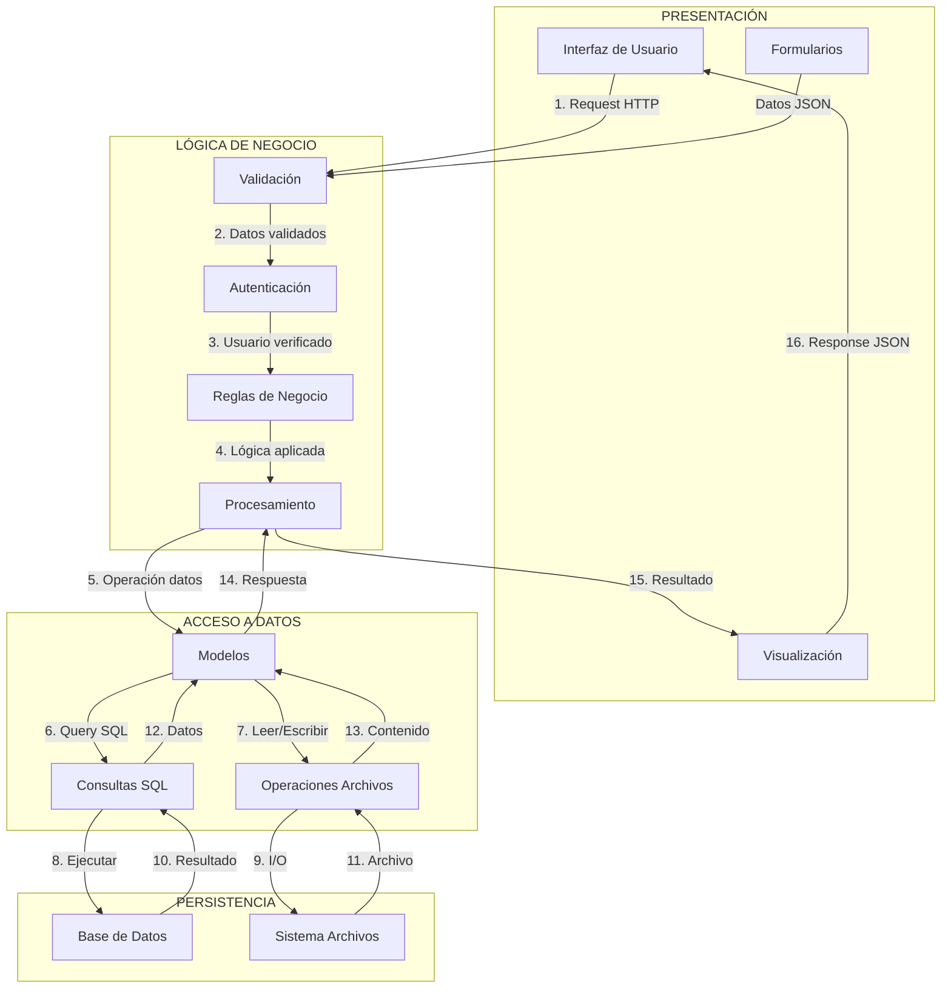
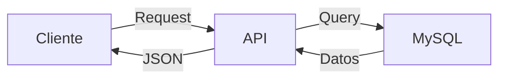
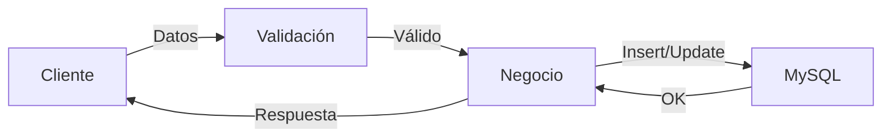
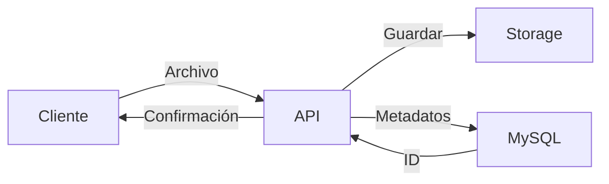
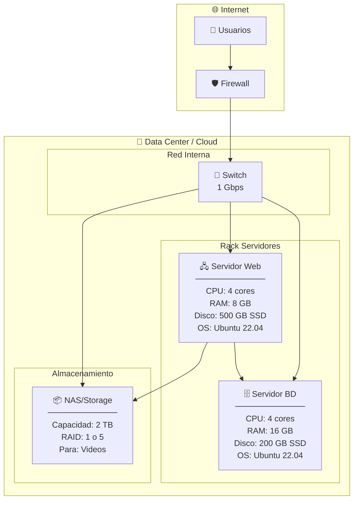
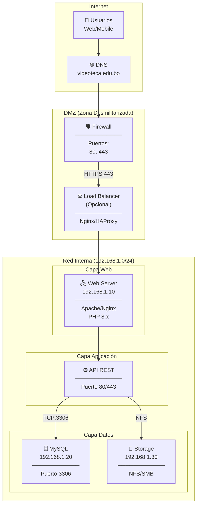
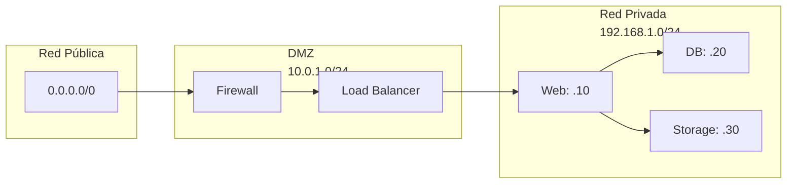
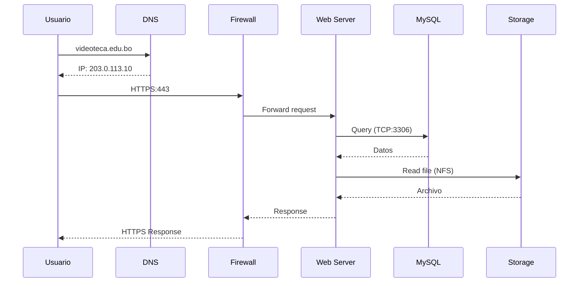

# Flujo de Datos, Arquitectura Física y de Red

## Flujo de Datos entre Capas

## Flujo Detallado por Operación

### Lectura (GET)

### Escritura (POST/PUT)

### Subida de Archivo

---

## Arquitectura Física

## Especificaciones de Hardware

| Componente | Mínimo | Recomendado |
|------------|--------|-------------|
| **Servidor Web** |
| CPU | 2 cores | 4+ cores |
| RAM | 4 GB | 8+ GB |
| Disco | 100 GB | 500 GB SSD |
| **Servidor BD** |
| CPU | 2 cores | 4+ cores |
| RAM | 4 GB | 16+ GB |
| Disco | 50 GB | 200 GB SSD |
| **Storage** |
| Capacidad | 500 GB | 2+ TB |
| Tipo | HDD | SSD/NVMe |

---

## Arquitectura de Red

## Configuración de Red

### Puertos y Protocolos

| Puerto | Protocolo | Servicio | Acceso |
|--------|-----------|----------|--------|
| 80 | HTTP | Web Server | Público (redirige a 443) |
| 443 | HTTPS | Web Server | Público |
| 3306 | MySQL | Base de Datos | Solo interno |
| 22 | SSH | Administración | Solo VPN/interno |
| 2049 | NFS | Storage | Solo interno |

### Segmentación de Red

### Reglas de Firewall

| Origen | Destino | Puerto | Acción |
|--------|---------|--------|--------|
| Internet | DMZ | 443 | ALLOW |
| Internet | DMZ | 80 | ALLOW (redirect) |
| DMZ | Web Server | 443 | ALLOW |
| Web Server | DB Server | 3306 | ALLOW |
| Web Server | Storage | 2049 | ALLOW |
| * | * | * | DENY |

## Diagrama de Comunicación

