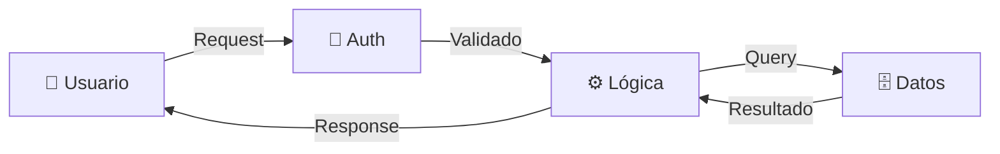
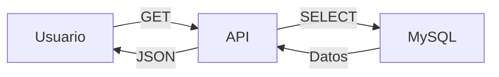
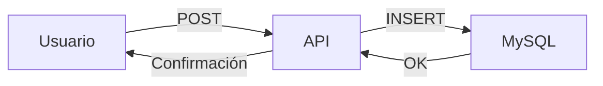
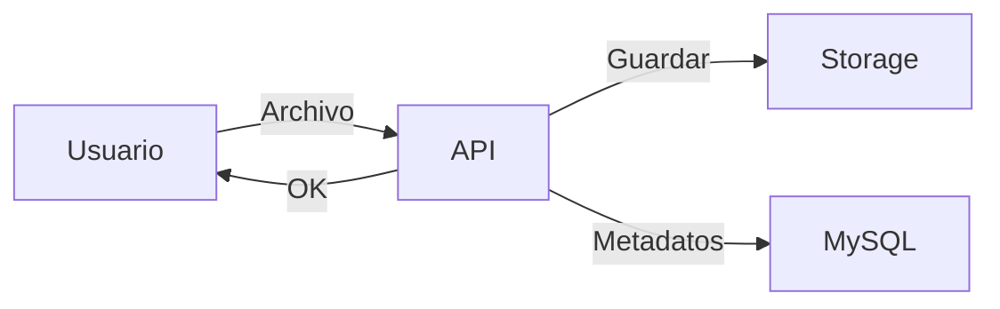
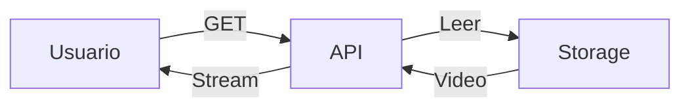
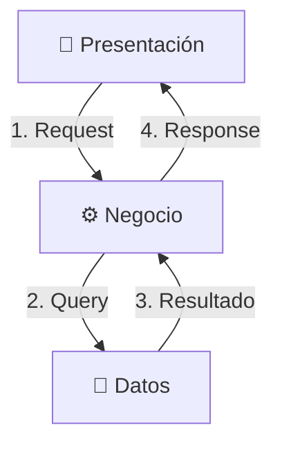

# Flujo de Datos - Versión Simplificada

## Flujo General

## Por Tipo de Operación

### Consultar Datos

### Guardar Datos

### Subir Video

### Streaming

## Flujo entre Capas

## Resumen

| Operación | Flujo |
|-----------|-------|
| **GET** | Cliente → API → MySQL → API → Cliente |
| **POST** | Cliente → API → MySQL → API → Cliente |
| **Upload** | Cliente → API → Storage + MySQL → Cliente |
| **Stream** | Cliente → API → Storage → Cliente |
