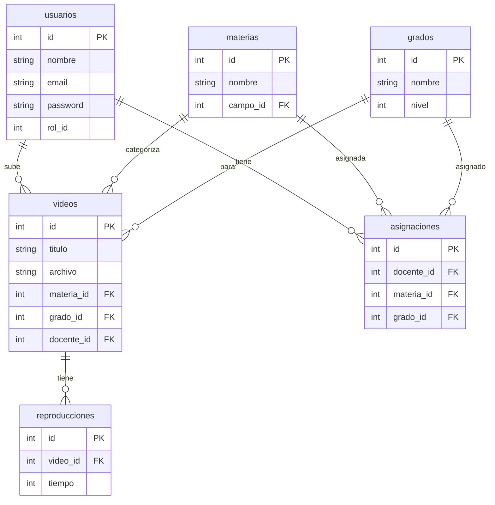
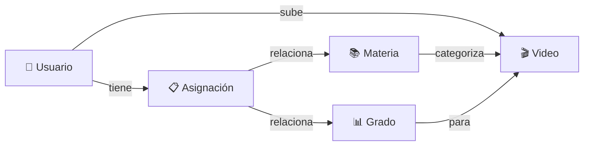
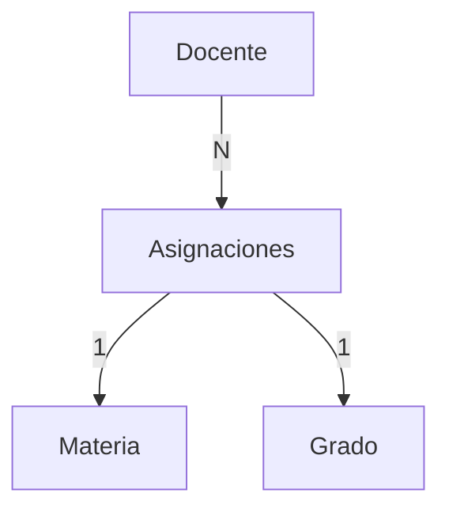

# Entidad-Relación - Versión Simplificada

## Diagrama Principal

## Relaciones Clave

## Tablas Principales

| Tabla | Descripción | Registros |
|-------|-------------|-----------|
| **usuarios** | Admins y docentes | Variable |
| **videos** | Catálogo de videos | Variable |
| **materias** | 14 asignaturas | 14 |
| **grados** | 6 niveles secundaria | 6 |
| **asignaciones** | Docente-Materia-Grado | Variable |
| **reproducciones** | Historial de vistas | Variable |

## Tabla Central: Asignaciones

**Ejemplo:** Juan (docente) → Matemáticas + 1°, 2°, 3° secundaria

## Resumen de Relaciones

| Relación | Tipo | Descripción |
|----------|------|-------------|
| Usuario → Video | 1:N | Un docente sube muchos videos |
| Usuario → Asignación | 1:N | Un docente tiene muchas asignaciones |
| Materia → Video | 1:N | Una materia tiene muchos videos |
| Grado → Video | 1:N | Un grado tiene muchos videos |
| Video → Reproducción | 1:N | Un video tiene muchas reproducciones |
