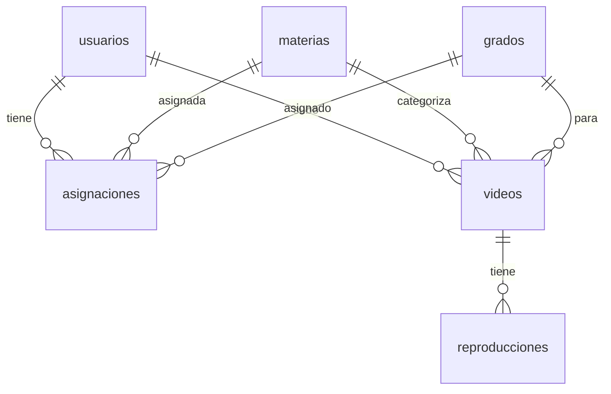

# Modelo Físico DDL - Versión Simplificada

## Tablas Principales

```sql
-- USUARIOS (Admins y Docentes)
CREATE TABLE usuarios (
    id INT PRIMARY KEY AUTO_INCREMENT,
    nombre VARCHAR(100) NOT NULL,
    email VARCHAR(100) UNIQUE NOT NULL,
    password_hash VARCHAR(255) NOT NULL,
    rol_id INT NOT NULL,
    estado ENUM('activo', 'inactivo') DEFAULT 'activo',
    FOREIGN KEY (rol_id) REFERENCES roles(id)
);

-- MATERIAS
CREATE TABLE materias (
    id INT PRIMARY KEY AUTO_INCREMENT,
    nombre VARCHAR(100) NOT NULL,
    sigla VARCHAR(10) NOT NULL,
    campo_id INT NOT NULL,
    FOREIGN KEY (campo_id) REFERENCES campos(id)
);

-- GRADOS
CREATE TABLE grados (
    id INT PRIMARY KEY AUTO_INCREMENT,
    nombre VARCHAR(100) NOT NULL,
    nivel INT NOT NULL,
    sigla VARCHAR(10) NOT NULL
);

-- ASIGNACIONES (Tabla Central)
CREATE TABLE asignaciones (
    id INT PRIMARY KEY AUTO_INCREMENT,
    docente_id INT NOT NULL,
    materia_id INT NOT NULL,
    grado_id INT NOT NULL,
    fecha_asignacion DATETIME DEFAULT CURRENT_TIMESTAMP,
    FOREIGN KEY (docente_id) REFERENCES usuarios(id),
    FOREIGN KEY (materia_id) REFERENCES materias(id),
    FOREIGN KEY (grado_id) REFERENCES grados(id),
    UNIQUE KEY (docente_id, materia_id, grado_id)
);

-- VIDEOS
CREATE TABLE videos (
    id INT PRIMARY KEY AUTO_INCREMENT,
    titulo VARCHAR(255) NOT NULL,
    descripcion TEXT,
    archivo_path VARCHAR(500) NOT NULL,
    duracion INT,
    materia_id INT NOT NULL,
    grado_id INT NOT NULL,
    docente_id INT NOT NULL,
    visualizaciones INT DEFAULT 0,
    estado ENUM('activo', 'inactivo') DEFAULT 'activo',
    fecha_subida DATETIME DEFAULT CURRENT_TIMESTAMP,
    FOREIGN KEY (materia_id) REFERENCES materias(id),
    FOREIGN KEY (grado_id) REFERENCES grados(id),
    FOREIGN KEY (docente_id) REFERENCES usuarios(id),
    FULLTEXT INDEX (titulo, descripcion)
);

-- REPRODUCCIONES
CREATE TABLE reproducciones (
    id INT PRIMARY KEY AUTO_INCREMENT,
    video_id INT NOT NULL,
    usuario_id INT,
    tiempo_reproducido INT DEFAULT 0,
    fecha_inicio DATETIME DEFAULT CURRENT_TIMESTAMP,
    FOREIGN KEY (video_id) REFERENCES videos(id),
    FOREIGN KEY (usuario_id) REFERENCES usuarios(id)
);
```

## Diagrama de Relaciones



## Resumen de Tablas

| Tabla | Columnas Clave | FK |
|-------|----------------|-----|
| **usuarios** | id, nombre, email, rol_id | rol_id |
| **materias** | id, nombre, campo_id | campo_id |
| **grados** | id, nombre, nivel | - |
| **asignaciones** | docente_id, materia_id, grado_id | 3 FK |
| **videos** | id, titulo, archivo_path, docente_id | 3 FK |
| **reproducciones** | id, video_id, tiempo | 2 FK |

## Índices Importantes

```sql
-- Búsqueda de videos
FULLTEXT INDEX idx_busqueda ON videos(titulo, descripcion);

-- Evitar asignaciones duplicadas
UNIQUE INDEX idx_asignacion ON asignaciones(docente_id, materia_id, grado_id);

-- Consultas frecuentes
INDEX idx_video_materia ON videos(materia_id);
INDEX idx_video_grado ON videos(grado_id);
INDEX idx_video_docente ON videos(docente_id);
```

## Trigger Principal

```sql
-- Incrementar visualizaciones automáticamente
CREATE TRIGGER after_reproduccion_insert
AFTER INSERT ON reproducciones
FOR EACH ROW
BEGIN
    UPDATE videos
    SET visualizaciones = visualizaciones + 1
    WHERE id = NEW.video_id;
END;
```
