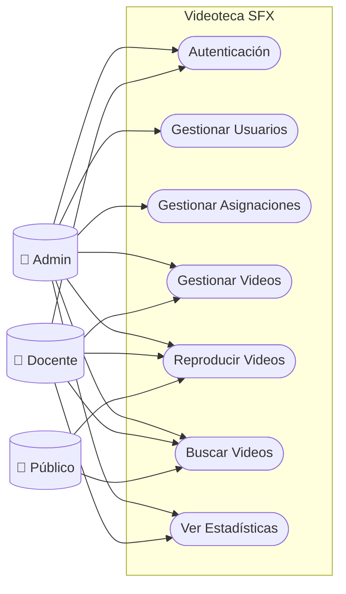

# Requerimientos del Sistema - Videoteca SFX

## Requerimientos Funcionales

### RF01 - Autenticación
| ID | Requerimiento |
|----|---------------|
| RF01.1 | El sistema debe permitir login con email y contraseña |
| RF01.2 | El sistema debe generar tokens JWT (access + refresh) |
| RF01.3 | El sistema debe bloquear usuarios tras 5 intentos fallidos |
| RF01.4 | El sistema debe permitir renovar tokens expirados |
| RF01.5 | El sistema debe permitir cerrar sesión |

### RF02 - Gestión de Usuarios
| ID | Requerimiento |
|----|---------------|
| RF02.1 | El admin debe poder crear usuarios (admin/docente) |
| RF02.2 | El admin debe poder editar cualquier usuario |
| RF02.3 | El admin debe poder eliminar usuarios (soft delete) |
| RF02.4 | El admin debe poder listar usuarios con filtros |
| RF02.5 | El usuario debe poder editar su propio perfil |
| RF02.6 | El usuario debe poder cambiar su contraseña |

### RF03 - Asignaciones
| ID | Requerimiento |
|----|---------------|
| RF03.1 | El admin debe poder asignar materias a docentes |
| RF03.2 | El admin debe poder asignar grados a docentes |
| RF03.3 | El sistema debe validar asignaciones antes de subir videos |
| RF03.4 | El admin debe poder ver todas las asignaciones |

### RF04 - Gestión de Videos
| ID | Requerimiento |
|----|---------------|
| RF04.1 | El docente debe poder subir videos (.mp4, .avi, .mov) |
| RF04.2 | El sistema debe extraer metadatos automáticamente |
| RF04.3 | El sistema debe generar thumbnails automáticamente |
| RF04.4 | El docente debe poder editar sus propios videos |
| RF04.5 | El docente debe poder eliminar sus propios videos |
| RF04.6 | El admin debe poder gestionar cualquier video |

### RF05 - Reproducción
| ID | Requerimiento |
|----|---------------|
| RF05.1 | El sistema debe permitir streaming de videos |
| RF05.2 | El sistema debe soportar Range Requests (HTTP 206) |
| RF05.3 | El sistema debe registrar cada reproducción |
| RF05.4 | El sistema debe incrementar contador de visualizaciones |

### RF06 - Búsqueda
| ID | Requerimiento |
|----|---------------|
| RF06.1 | El sistema debe permitir búsqueda por texto (FULLTEXT) |
| RF06.2 | El sistema debe permitir filtrar por materia |
| RF06.3 | El sistema debe permitir filtrar por grado |
| RF06.4 | El sistema debe permitir filtrar por tema |
| RF06.5 | El sistema debe mostrar videos populares |
| RF06.6 | El sistema debe mostrar videos recientes |

### RF07 - Estadísticas
| ID | Requerimiento |
|----|---------------|
| RF07.1 | El admin debe ver dashboard general |
| RF07.2 | El admin debe ver métricas por materia |
| RF07.3 | El admin debe ver métricas por grado |
| RF07.4 | El docente debe ver estadísticas de sus videos |

### RF08 - Catálogo
| ID | Requerimiento |
|----|---------------|
| RF08.1 | El sistema debe mostrar campos de saberes |
| RF08.2 | El sistema debe mostrar materias por campo |
| RF08.3 | El sistema debe mostrar grados disponibles |
| RF08.4 | El sistema debe mostrar temas por materia/grado |

---

## Requerimientos No Funcionales

### RNF01 - Seguridad
| ID | Requerimiento |
|----|---------------|
| RNF01.1 | Passwords hasheados con bcrypt (cost 12) |
| RNF01.2 | Tokens JWT firmados con HMAC-SHA256 |
| RNF01.3 | Prepared statements para prevenir SQL injection |
| RNF01.4 | Sanitización de datos para prevenir XSS |
| RNF01.5 | HTTPS obligatorio en producción |
| RNF01.6 | Access token expira en 1 hora |
| RNF01.7 | Refresh token expira en 7 días |

### RNF02 - Rendimiento
| ID | Requerimiento |
|----|---------------|
| RNF02.1 | Tiempo de respuesta API < 500ms |
| RNF02.2 | Streaming por chunks de 8 KB |
| RNF02.3 | Índice FULLTEXT para búsquedas rápidas |
| RNF02.4 | Paginación en listados (máx 50 items) |
| RNF02.5 | Conexión BD singleton (reutilizable) |

### RNF03 - Disponibilidad
| ID | Requerimiento |
|----|---------------|
| RNF03.1 | Sistema disponible 24/7 |
| RNF03.2 | Limpieza automática de tokens (diario) |
| RNF03.3 | Generación automática de estadísticas (diario) |

### RNF04 - Escalabilidad
| ID | Requerimiento |
|----|---------------|
| RNF04.1 | Soportar hasta 100 usuarios concurrentes |
| RNF04.2 | Almacenar hasta 10,000 videos |
| RNF04.3 | Tamaño máximo de video: 500 MB |

### RNF05 - Usabilidad
| ID | Requerimiento |
|----|---------------|
| RNF05.1 | Interfaz responsive (web y mobile) |
| RNF05.2 | Mensajes de error claros |
| RNF05.3 | Navegación intuitiva por catálogo |

### RNF06 - Mantenibilidad
| ID | Requerimiento |
|----|---------------|
| RNF06.1 | Código organizado en capas (MVC) |
| RNF06.2 | Logs de auditoría completos |
| RNF06.3 | Soft delete para preservar datos |
| RNF06.4 | Documentación UML actualizada |

### RNF07 - Compatibilidad
| ID | Requerimiento |
|----|---------------|
| RNF07.1 | Navegadores: Chrome, Firefox, Safari, Edge |
| RNF07.2 | Formatos video: MP4, AVI, MOV, MKV |
| RNF07.3 | PHP 8.0 o superior |
| RNF07.4 | MySQL 8.0 o MariaDB 10.x |

---

## Casos de Uso del Sistema

### Diagrama General

### Lista de Casos de Uso

| CU | Nombre | Actor Principal | Descripción |
|----|--------|-----------------|-------------|
| CU01 | Iniciar sesión | Todos | Autenticar usuario con email/password |
| CU02 | Cerrar sesión | Todos | Revocar tokens y salir |
| CU03 | Crear usuario | Admin | Registrar nuevo admin/docente |
| CU04 | Editar usuario | Admin/Usuario | Modificar datos de usuario |
| CU05 | Eliminar usuario | Admin | Desactivar usuario |
| CU06 | Asignar materias | Admin | Asignar materias a docente |
| CU07 | Asignar grados | Admin | Asignar grados a docente |
| CU08 | Subir video | Admin/Docente | Subir video educativo |
| CU09 | Editar video | Admin/Docente | Modificar metadatos |
| CU10 | Eliminar video | Admin/Docente | Desactivar video |
| CU11 | Reproducir video | Todos | Ver video en streaming |
| CU12 | Buscar videos | Todos | Buscar por texto/filtros |
| CU13 | Ver dashboard | Admin | Ver estadísticas generales |
| CU14 | Ver mis estadísticas | Docente | Ver métricas propias |

### Caso de Uso Detallado: Subir Video

**CU08 - Subir Video**

| Campo | Descripción |
|-------|-------------|
| **Actor** | Docente / Admin |
| **Precondición** | Usuario autenticado, docente con asignaciones |
| **Postcondición** | Video guardado y disponible |

**Flujo Principal:**
1. Usuario selecciona archivo de video
2. Usuario completa título, materia, grado
3. Sistema valida permisos del docente
4. Sistema sube archivo al storage
5. Sistema extrae metadatos
6. Sistema genera thumbnail
7. Sistema crea registro en BD
8. Sistema confirma éxito

**Flujo Alternativo:**
- 3a. Docente sin asignación → Error 403
- 4a. Archivo inválido → Error 400
- 6a. FFmpeg no disponible → Sin thumbnail

### Caso de Uso Detallado: Reproducir Video

**CU11 - Reproducir Video**

| Campo | Descripción |
|-------|-------------|
| **Actor** | Público / Docente / Admin |
| **Precondición** | Video existe y está activo |
| **Postcondición** | Video reproducido, estadísticas actualizadas |

**Flujo Principal:**
1. Usuario solicita video
2. Sistema verifica que video existe
3. Sistema registra reproducción
4. Sistema envía stream por chunks
5. Sistema actualiza visualizaciones

**Flujo Alternativo:**
- 2a. Video no existe → Error 404
- 2b. Video inactivo → Error 403
