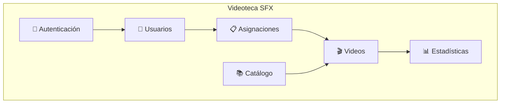
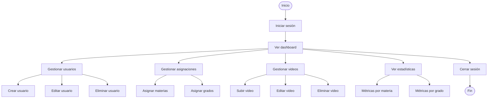
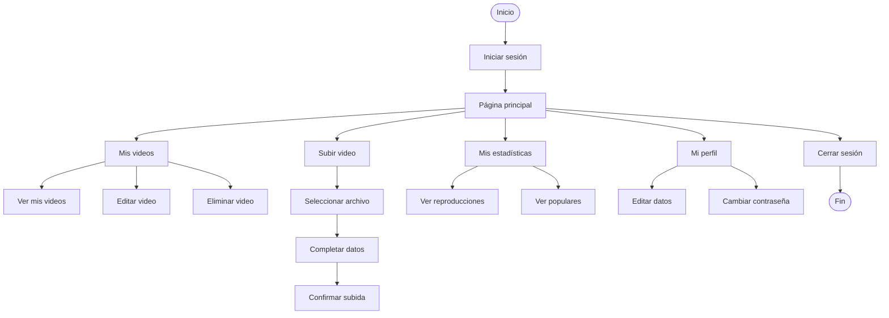
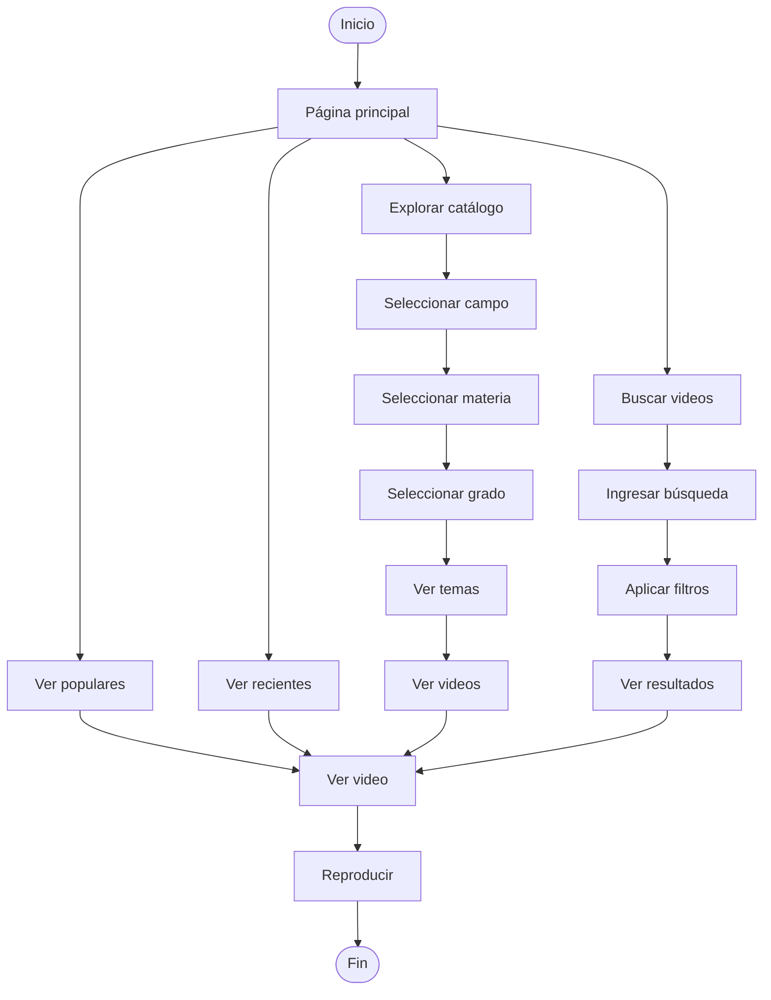
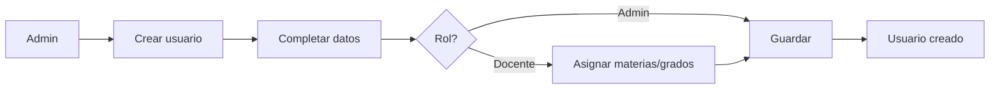
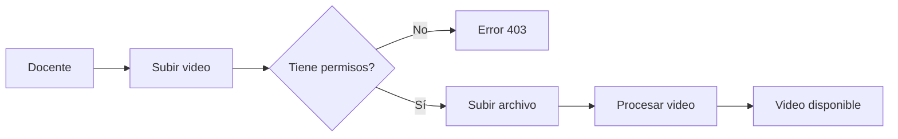
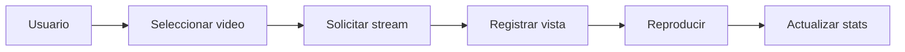
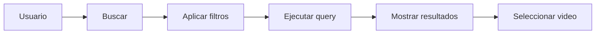
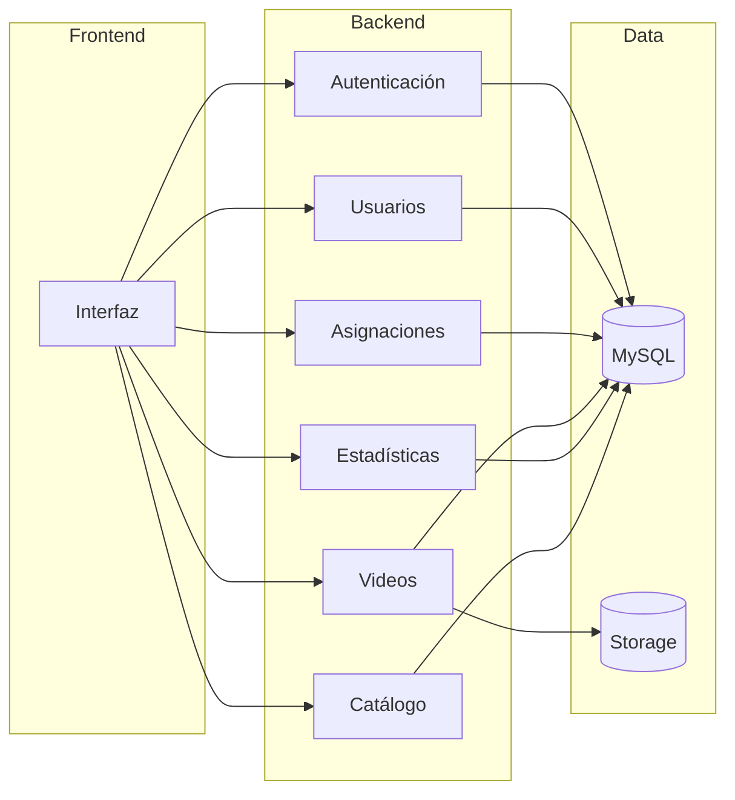

# Flujos de Usuario y Módulos del Sistema

## Módulos del Sistema

### Descripción de Módulos

| Módulo | Funcionalidad |
|--------|---------------|
| **Autenticación** | Login, logout, tokens JWT |
| **Usuarios** | CRUD de admins y docentes |
| **Asignaciones** | Asignar materias/grados a docentes |
| **Videos** | Subir, editar, eliminar, streaming |
| **Estadísticas** | Dashboard, métricas, reportes |
| **Catálogo** | Campos, materias, grados, temas |

---

## Flujos de Usuario

### Administrador

### Docente

### Estudiante/Público

---

## Flujos por Funcionalidad

### Flujo de Registro de Usuario

### Flujo de Subida de Video

### Flujo de Reproducción

### Flujo de Búsqueda

---

## Interacción entre Módulos

---

## Resumen de Flujos

| Usuario | Flujos Principales |
|---------|-------------------|
| **Admin** | Login → Dashboard → Gestionar (usuarios, asignaciones, videos) → Estadísticas → Logout |
| **Docente** | Login → Mis videos → Subir/Editar → Mis estadísticas → Logout |
| **Público** | Explorar catálogo → Buscar → Filtrar → Reproducir video |
