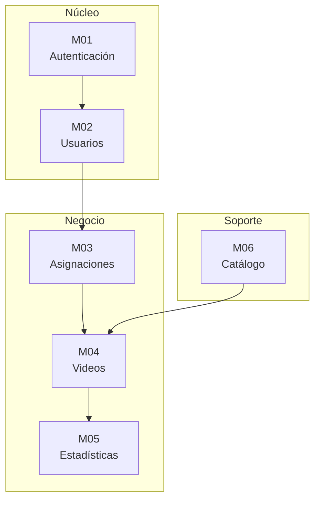

# Módulos Detallados

## M01 - Módulo de Autenticación

### Descripción
Gestiona el acceso seguro al sistema mediante tokens JWT.

### Funcionalidades
| ID | Función | Descripción |
|----|---------|-------------|
| M01.1 | Login | Autenticar con email/password |
| M01.2 | Logout | Revocar tokens y cerrar sesión |
| M01.3 | Refresh | Renovar access token expirado |
| M01.4 | Bloqueo | Bloquear tras 5 intentos fallidos |
| M01.5 | Validación | Verificar JWT en cada request |

### Componentes
- `AuthController` - Lógica de autenticación
- `AuthMiddleware` - Validación de tokens
- `JWTHandler` - Generación y validación JWT

### Endpoints
```
POST /api/auth/login
POST /api/auth/logout
POST /api/auth/refresh
GET  /api/auth/me
```

---

## M02 - Módulo de Usuarios

### Descripción
Administración de usuarios del sistema (admins y docentes).

### Funcionalidades
| ID | Función | Descripción |
|----|---------|-------------|
| M02.1 | Crear | Registrar nuevo usuario |
| M02.2 | Listar | Ver todos los usuarios con filtros |
| M02.3 | Ver | Obtener detalle de usuario |
| M02.4 | Editar | Modificar datos de usuario |
| M02.5 | Eliminar | Desactivar usuario (soft delete) |
| M02.6 | Password | Cambiar contraseña |

### Componentes
- `UsuarioController` - Lógica de gestión
- `Usuario` (Model) - Acceso a datos
- `RoleMiddleware` - Control de permisos

### Endpoints
```
GET    /api/usuarios
POST   /api/usuarios
GET    /api/usuarios/{id}
PUT    /api/usuarios/{id}
DELETE /api/usuarios/{id}
PUT    /api/usuarios/{id}/password
```

---

## M03 - Módulo de Asignaciones

### Descripción
Gestión de asignaciones docente-materia-grado.

### Funcionalidades
| ID | Función | Descripción |
|----|---------|-------------|
| M03.1 | Asignar | Asignar materias y grados a docente |
| M03.2 | Listar | Ver asignaciones de un docente |
| M03.3 | Verificar | Validar permisos para subir video |
| M03.4 | Consolidar | Ver todos los docentes con asignaciones |

### Componentes
- `DocenteAsignacionController` - Lógica de asignaciones
- `DocenteAsignacion` (Model) - Acceso a datos

### Endpoints
```
GET  /api/docentes-asignaciones
GET  /api/docentes/{id}/asignaciones
POST /api/docentes/{id}/asignaciones
```

---

## M04 - Módulo de Videos

### Descripción
Gestión completa de videos educativos.

### Funcionalidades
| ID | Función | Descripción |
|----|---------|-------------|
| M04.1 | Subir | Subir archivo de video |
| M04.2 | Procesar | Extraer metadatos y thumbnail |
| M04.3 | Listar | Ver videos con filtros y paginación |
| M04.4 | Ver | Obtener detalle de video |
| M04.5 | Editar | Modificar metadatos |
| M04.6 | Eliminar | Desactivar video |
| M04.7 | Stream | Reproducir con Range Requests |
| M04.8 | Buscar | Búsqueda FULLTEXT |
| M04.9 | Populares | Top videos por visualizaciones |
| M04.10 | Recientes | Últimos videos subidos |

### Componentes
- `VideoController` - Lógica de gestión
- `Video` (Model) - Acceso a datos
- `FileHandler` - Gestión de archivos
- `VideoProcessor` - Metadatos y thumbnails

### Endpoints
```
GET    /api/videos
POST   /api/videos
GET    /api/videos/{id}
PUT    /api/videos/{id}
DELETE /api/videos/{id}
GET    /api/videos/{id}/stream
GET    /api/videos/buscar
GET    /api/videos/populares
GET    /api/videos/recientes
```

---

## M05 - Módulo de Estadísticas

### Descripción
Métricas y reportes del sistema.

### Funcionalidades
| ID | Función | Descripción |
|----|---------|-------------|
| M05.1 | Dashboard | Estadísticas generales |
| M05.2 | Por materia | Métricas agrupadas por materia |
| M05.3 | Por grado | Métricas agrupadas por grado |
| M05.4 | Tendencias | Evolución temporal |
| M05.5 | Por docente | Estadísticas individuales |

### Componentes
- `EstadisticaController` - Lógica de métricas
- `Estadistica` (Model) - Acceso a datos
- `Reproduccion` (Model) - Datos de vistas

### Endpoints
```
GET /api/estadisticas/dashboard
GET /api/estadisticas/generales
GET /api/estadisticas/por-materia
GET /api/estadisticas/por-grado
GET /api/estadisticas/tendencias
GET /api/estadisticas/docente/{id}
```

---

## M06 - Módulo de Catálogo

### Descripción
Estructura curricular del sistema educativo boliviano.

### Funcionalidades
| ID | Función | Descripción |
|----|---------|-------------|
| M06.1 | Campos | Listar campos de saberes (4) |
| M06.2 | Materias | Listar materias por campo (14) |
| M06.3 | Grados | Listar grados de secundaria (6) |
| M06.4 | Temas | Listar temas por materia/grado |

### Componentes
- `CampoController`, `MateriaController`, `GradoController`, `TemaController`
- Models: `Campo`, `Materia`, `Grado`, `Tema`

### Endpoints
```
GET /api/campos
GET /api/campos/{id}/materias
GET /api/materias
GET /api/materias/{id}/temas
GET /api/grados
GET /api/grados/{id}/temas
GET /api/temas
```

---

## Diagrama de Módulos


