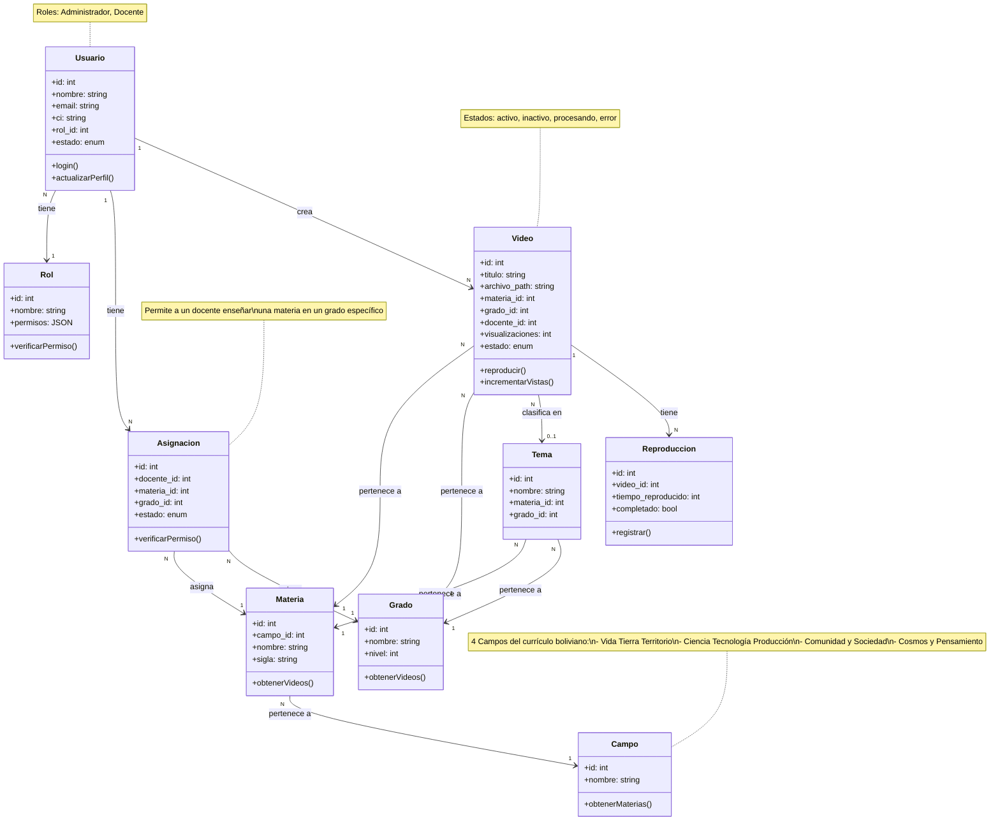

# Diagrama de Clases Simplificado - Videoteca SFX

**Sistema de Biblioteca Digital de Videos Educativos**
Versión simplificada enfocada en las entidades principales y sus relaciones clave.

---

## Diagrama



---

## Descripción de las Entidades

### 👤 **Usuario**
Representa a los usuarios del sistema (Administradores y Docentes).

**Atributos principales:**
- `id`: Identificador único
- `nombre`, `email`, `ci`: Datos personales
- `rol_id`: Define si es Admin o Docente
- `estado`: activo, inactivo, suspendido

**Operaciones:**
- Login al sistema
- Actualizar perfil

---

### 🎭 **Rol**
Define los permisos de cada tipo de usuario.

**Roles disponibles:**
- **Administrador**: Control total del sistema
- **Docente**: Gestión de sus propios videos

---

### 🎥 **Video**
Contenido educativo del sistema.

**Atributos principales:**
- `titulo`: Nombre del video
- `archivo_path`: Ubicación del archivo
- `visualizaciones`: Contador de reproducciones
- `estado`: activo, inactivo, procesando, error

**Relaciones:**
- Pertenece a una **Materia** y **Grado**
- Opcionalmente clasifica en un **Tema**
- Creado por un **Usuario** (Docente)

---

### 📚 **Materia**
Asignatura del currículo educativo boliviano.

**Ejemplos:**
- Matemática
- Física
- Lengua Castellana
- Biología-Geografía

**Relación:**
- Pertenece a un **Campo** de saberes

---

### 🎓 **Grado**
Nivel educativo (1ro a 6to de secundaria).

**Atributos:**
- `nivel`: 1, 2, 3, 4, 5, 6

---

### 🌍 **Campo**
Campos de Saberes y Conocimientos del currículo boliviano.

**4 Campos:**
1. **Vida Tierra Territorio**: Ciencias Naturales
2. **Ciencia Tecnología Producción**: Matemática, TTG
3. **Comunidad y Sociedad**: Lenguajes, Sociales, Artes
4. **Cosmos y Pensamiento**: Filosofía, Valores

---

### 📖 **Tema**
Contenido específico dentro de una materia y grado.

**Ejemplo:**
- Materia: Matemática
- Grado: 1ro de Secundaria
- Tema: "Números Enteros Aplicados a la Cotidianidad"

---

### 🔗 **Asignación**
Relaciona un Docente con una Materia en un Grado específico.

**Función:**
Permite al sistema saber:
- ¿Qué materias enseña cada docente?
- ¿En qué grados puede subir videos?

**Ejemplo:**
- Roger Luna → Matemática → 4to, 5to, 6to

---

### ▶️ **Reproducción**
Registro de cada vez que se reproduce un video.

**Atributos:**
- `tiempo_reproducido`: Segundos vistos
- `completado`: Si vio el video completo
- `porcentaje_visto`: % del video reproducido

---

## Relaciones Clave

### 1️⃣ **Usuario tiene Rol**
- Cada usuario tiene un único rol
- Define los permisos del usuario

### 2️⃣ **Usuario tiene Asignaciones** (Docentes)
- Un docente puede tener múltiples asignaciones
- Cada asignación = Materia + Grado

### 3️⃣ **Usuario crea Videos** (Docentes)
- Un docente crea múltiples videos
- Solo para materias/grados asignados

### 4️⃣ **Video pertenece a Materia y Grado**
- Clasificación curricular del video
- Obligatorio para todos los videos

### 5️⃣ **Materia pertenece a Campo**
- Organización del currículo boliviano
- 14 materias en 4 campos

### 6️⃣ **Video tiene Reproducciones**
- Registro de visualizaciones
- Estadísticas del sistema

---

## Flujo Principal

```
1. ADMINISTRADOR crea usuarios DOCENTES
2. ADMINISTRADOR asigna MATERIAS y GRADOS a docentes (Asignaciones)
3. DOCENTE sube VIDEOS de sus materias asignadas
4. ESTUDIANTES (anónimos) reproducen videos
5. SISTEMA registra Reproducciones
6. SISTEMA genera estadísticas
```

---

## Reglas de Negocio

### ✅ **Permisos de Docentes**
- Solo pueden subir videos de materias/grados que tienen asignados
- Verificación mediante tabla `asignaciones`

### ✅ **Clasificación de Videos**
- Todo video debe tener: Materia + Grado
- Tema es opcional

### ✅ **Estructura Curricular**
```
Campo (4)
  └─ Materia (14)
       └─ Tema (múltiples por materia/grado)
```

### ✅ **Control de Acceso**
- **Administrador**: Acceso completo
- **Docente**: Solo sus videos y materias
- **Público**: Solo visualización

---

## Diferencias con Diagrama Completo

Este diagrama **simplificado** omite:
- ❌ Tokens de autenticación
- ❌ Logs del sistema
- ❌ Estadísticas
- ❌ Atributos de auditoría (fechas, timestamps)
- ❌ Atributos técnicos (thumbnails, codec, formato)
- ❌ Métodos detallados de cada clase

**Propósito:** Facilitar la comprensión general del sistema sin detalles técnicos.

---

## Tecnologías

- **Backend**: PHP 8.x con PDO
- **Base de Datos**: MySQL/MariaDB
- **Patrón**: MVC + Repository
- **Autenticación**: JWT (HMAC-SHA256)
- **Frontend**: React (Web) + React Native (Móvil)

---

**Autor**: Roger Omar Luna Yujra
**Institución**: U.E. San Francisco Xavier
**Proyecto**: Videoteca SFX - Sistema de Biblioteca Digital de Videos Educativos
**Fecha**: 2024
